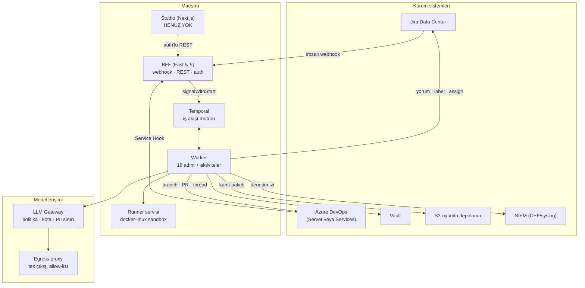
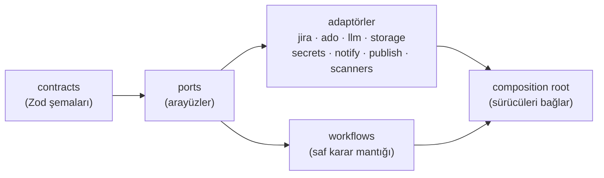

# Maestro

> Jira ile tetiklenen, insan onay kapılı, AI destekli SDLC otomasyon platformu — kurum içi.
> © 2026 Uğur Yıldız — tüm hakları saklıdır (bkz. [LICENSE](LICENSE)).

| | |
|---|---|
| **Ne yapar** | Jira'da açılan bir ticket'tan başlar; analiz yazar, kodu izole sandbox'ta üretir, testleri gerçekten koşturur, Azure DevOps'ta PR açar — her kritik noktada **insan onayı** bekler |
| **Kim için** | Finans kuruluşu içi yazılım geliştirme takımları (PO · Tech Lead · QA · geliştirici · platform ekibi) |
| **Karar kaydı** | [`plan/masterplan.md`](plan/masterplan.md) — M1–M109, kilitli |
| **Doküman haritası** | [`docs/README.md`](docs/README.md) |
| **Bugünkü durum** | Dalga 0–3 kod tamam · Dalga 4 (Studio, deploy, runner daemon) **yazılmadı** — bkz. [§ Bugün ne çalışıyor](#bugün-ne-çalışıyor-ne-çalışmıyor) |

---

## 1. Tek paragrafta

Jira'da bir ticket açılır. Maestro webhook'u alır, ticket'ın eksiğini **yorumla sorar**,
sonra repo'yu salt-okunur gezerek bir analiz belgesi yazar ve Jira'ya yorum olarak koyar.
İnsan `/approve` der. Onaydan sonra AI, sertleştirilmiş bir konteynerin içinde kodu yazar;
gitleaks/semgrep/trivy taramaları **fail-closed** koşar, testler **gerçekten** çalıştırılır,
ADO'da PR açılır ve branch policy'nin build validation'ı beklenir. QA ve Tech Lead onaylar,
merge olur, tek arşivlenebilir **kanıt paketi** üretilir. Her adım hash-zincirli denetim
izine yazılır; kapı 16 gün açık kalsa bile hiçbir şey otomatik onaylanmaz ve ajanın bağlamı
kaybolmaz.

**Prod'a hiçbir şey çıkarmaz.** Release kurumun kendi sürecidir; Maestro merge'e kadar gelir.

---

## 2. 19 adımlık akış

Adım kimlikleri koddan gelir: [`packages/contracts/src/workflow.ts`](packages/contracts/src/workflow.ts) → `STEP_IDS`.

| # | Adım | Tür | Ne olur |
|---|---|---|---|
| **0** | Work mode seçimi | sistem | `full_auto` · `ai_assist` · `human_lead` · `human_only` çözülür |
| **2** | Intake — tamlık kontrolü | AI | Ucuz modelle ticket'ın yeterli olup olmadığı denetlenir |
| **2b** | Clarification | **insan beklemesi** | Eksik varsa reporter'a yorumla sorulur; **süresiz bekler**, otomatik ret yok |
| **3ö** | Repo keşfi | AI | Salt-okunur ajan oturumu repo'yu gezer |
| **3** | Analiz + etki matrisi | AI | Şablon-doğrulamalı analiz belgesi üretilir, Jira'ya yayınlanır |
| **4** | **PO onayı** | **kapı** | `/approve` — grup üyeliği doğrulanır |
| **5** | **Tech Lead onayı** | **kapı** | SoD: PO ile aynı kişi olamaz (M32) |
| **6a** | Geliştirme | AI | Sertleştirilmiş sandbox'ta ajan oturumu kodu yazar |
| **6b** | Güvenlik taraması | sistem | gitleaks · semgrep · trivy — **fail-closed** (M27) |
| **6c** | Dev-reviewer incelemesi | AI | Gerçek diff incelenir |
| **7** | Test senaryoları tasarımı | AI | |
| **8** | Test senaryoları denetimi | AI | Kapsam üzerinde 4-göz |
| **9** | **QA senaryo onayı** | **kapı** | Yalnız `kritik` risk kademesinde |
| **10** | Testlerin koşulması | AI | Testler **gerçekten** çalıştırılır |
| **10b** | CI kapısı | otomatik kapı | ADO build validation sinyali beklenir; sinyalin **kökeni doğrulanır** (M106) |
| **11** | **QA sonuç onayı** | **kapı** | |
| **12** | **PR onayı** | **kapı** | Tech Lead + ADO policy'nin min. 1 insan reviewer'ı |
| **12b** | PR yorum döngüsü | sistem | "changes requested" → 6a'ya dönüş, **aynı ajan oturumu** devam eder |
| **13** | Kanıt paketi ve kapanış | sistem | Merge → kanıt paketi → ticket kapanır |

### Risk kademesine göre kapı seti (M51)

| Risk | Onay kapıları | Sayı |
|---|---|---|
| `dusuk` | 5, 12 | 2 |
| `orta` | 4, 5, 11, 12 | 4 |
| `kritik` | 4, 5, 9, 11, 12 | 5 |

2b bir **onay kapısı değil**, süresiz insan beklemesidir ve her kademede olabilir.
Kaynak: `GATES_BY_RISK`, `APPROVAL_GATE_STEPS`.

---

## 3. Mimari — kuşbakışı



### Katman kuralı



`packages/contracts` ve `packages/ports` **donuktur**. Çekirdek hiçbir somut sürücüyü
import etmez; bağlama DI ile composition root'ta yapılır (M44). Ayrıntı:
[`docs/mimari.md`](docs/mimari.md).

---

## 4. Hızlı başlangıç

**Gereksinimler:** Node ≥ 24, pnpm 10.33.0, git. (Tam liste ve kurum kurulumu:
[`docs/kurulum.md`](docs/kurulum.md).)

```bash
cd maestro
pnpm install
pnpm run gate      # lint + typecheck + test, önbelleksiz
```

Çalışan bir şey görmek için — **tek çalıştırılabilir uygulama budur**:

```bash
# maestro/.env içine: OPENROUTER_API_KEY=...
pnpm -F @maestro/demo start
# tarayıcı: http://localhost:7010
```

Demoda Jira ve ADO **sahtedir** (yerel taklit sunucular, gerçek adaptörlerimizin konuştuğu
uçlar); model, PII maskeleme ve denetim izi **gerçektir**. Ayrıntı:
[`apps/demo/README.md`](apps/demo/README.md) ve [`docs/ilk-kosu.md`](docs/ilk-kosu.md).

---

## 5. Bugün ne çalışıyor, ne çalışmıyor

Bu bölüm dokümanın en önemli kısmıdır: **var olmayanı var göstermemek** için.

### Yazıldı ve testli (22 paket + 2 uygulama)

`contracts` · `ports` · `config` · `db` · `adapter-jira` · `adapter-ado` · `llm-gateway` ·
`storage` · `secrets` · `pii` · `audit` · `runners` · `execution` · `claude-driver` ·
`memory` · `notify` · `publish` · `scanners` · `workflows` · `mcp-servers` · `agent-roles` ·
`test-kit` · `apps/bff` · `apps/demo`

### HENÜZ YOK

| Ne | Nerede olmalı | Neden yok |
|---|---|---|
| **Studio (Next.js arayüzü)** | `apps/studio` | Dalga 4 kalemi. Bugün yalnız [`mock/index.html`](mock/index.html) prototipi var (37 ekran) |
| **Worker uygulaması** | `apps/worker` | `packages/workflows` worker'ı **kurar** (`createMaestroWorker`) ama onu ayağa kaldıran uygulama yok |
| **BFF composition root** | `apps/bff/src/main.ts` | Paket `buildServer(deps)` verir; sürücüleri bağlayan kök Dalga 4'te |
| **Runner Agent daemon** (win/mac) | `apps/runner-agent` | `packages/runners` yalnız **protokol şemasını** içerir; sunucu/dinleyici yok |
| **deploy/ (compose + Dockerfile)** | `deploy/` | Dalga 4 kalemi — bugün kurulabilir bir dağıtım artefaktı yok |
| **DB destekli depolar** | `apps/*` | BFF bugün `InMemory*` referans gerçeklemeleriyle çalışır |
| **docx/pdf yayın sürücüsü** (M103r) | `packages/publish` | Kurulum anında **reddediliyor** — hedef bilinçli olarak açılmadı |
| **AD/LDAP kimlik** (M8) | `apps/bff` | Arayüz hazır (`IdentityProvider`), sürücü yazılmadı; MVP lokal hesap |
| **`agent-macos` / `agent-windows` sürücüleri** | `packages/runners` | Yalnız `docker-linux` yazıldı (M21'in 3'te 1'i) |
| **Temporal sunucusu bağlantısı** | dağıtım | Testler `TestWorkflowEnvironment` ile koşar; gerçek Temporal'a bağlı bir koşum henüz yapılmadı |
| **Gerçek Jira/ADO duman testi** | — | Kurum erişimi gelmedi; contract testler kayıtlı gerçek yanıt fikstürleriyle koşuyor |

Daha uzun ve gerekçeli liste: [`docs/RAPOR.md`](docs/RAPOR.md).

---

## 6. Depo düzeni

```
maestro/
├── packages/
│   ├── contracts/     Zod şemaları — HER ŞEYİN TEMELİ (DONUK)
│   ├── ports/         Port arayüzleri (DONUK)
│   ├── config/        env doğrulama + i18n mesaj kataloğu (tr/en)
│   ├── db/            Prisma şema (17 model, 15 enum) + migration + seed
│   ├── adapter-jira/  Jira DC: istemci · ADF · webhook verify · komut grameri
│   ├── adapter-ado/   ADO çift-mod: repo/PR/thread + Service Hook
│   ├── llm-gateway/   4 API sürücüsü + abonelik havuzu + kota + PII sınırı
│   ├── execution/     Ajan oturumu orkestrasyonu (+ claude-driver)
│   ├── runners/       docker-linux sertleştirilmiş sandbox
│   ├── workflows/     Temporal 19 adım + kapılar + sinyaller
│   ├── agent-roles/   Rol promptları + şablondan üretilen çıktı şemaları
│   ├── mcp-servers/   jira · ado · workspace · maestro MCP sunucuları
│   └── …              memory · notify · publish · scanners · pii · audit · storage · secrets
├── apps/
│   ├── bff/           Fastify 5 BFF (kütüphane — çalıştırıcı kök yok)
│   └── demo/          Uçtan uca canlı demo (tek çalıştırılabilir uygulama)
├── mock/index.html    Studio prototipi — 37 ekran, Dalga 4'ün spec'i
├── plan/              masterplan · inşa planı · referanslar
└── docs/              bu dokümantasyon
```

---

## 7. Geliştirme kuralları

```bash
pnpm run lint        # eslint
pnpm run typecheck   # turbo run typecheck
pnpm run test        # turbo run test
pnpm run check       # üçü sırayla
pnpm run gate        # DALGA KAPISI — önbelleksiz (--force)
```

`pnpm run gate` ile `pnpm run check` arasındaki fark önemlidir: kapı `--force` ile koşar
ve **asla turbo önbelleğinden okumaz**. Önbellek bir kez gerçek bir hatayı sakladı.

`packages/contracts` ve `packages/ports` donuktur — değişiklik yalnız orkestratör kararıyla
(bkz. [`plan/insa-plani.md`](plan/insa-plani.md) §2).
