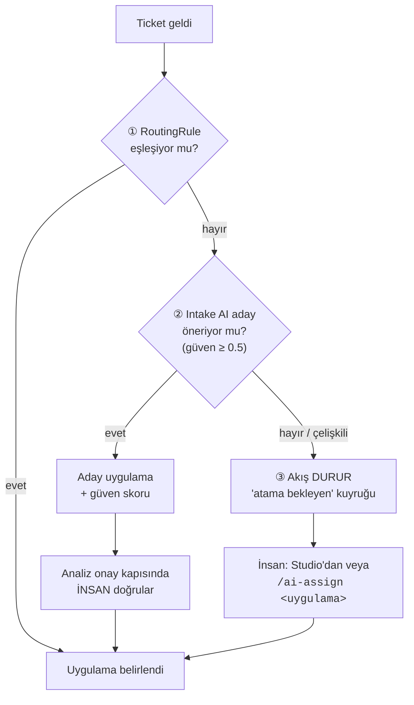

# Maestro — Jira ve Azure DevOps Bağlama Kılavuzu

*Servis hesabı · izin seti · global webhook · proje bağlama · ADO çift mod*

| Hazırlayan | Tarih | Versiyon | Kapsam |
|---|---|---|---|
| Maestro doküman ajanı | 09.08.2026 | v1.0 | Jira DC servis hesabı ve izinleri · tek global webhook · `JiraProjectBinding` · tetikleme modu · 3 kademeli eşleşme · Jira komut grameri · ADO çift mod, branch policy ve CI allow-list |

> **Kime:** Jira admin, ADO admin ve Maestro'yu kuran platform ekibi. Bir bölüm de
> proje yöneticileri içindir (§4 opt-in etiketi).
> **Ön koşullar:** [`kurulum.md`](kurulum.md) tamamlanmış olmalı. Jira'da global
> webhook tanımlama yetkisi ve ADO'da servis bağlantısı/PAT üretme yetkisi gerekir.

> [!WARNING]
> **Bağlamayı yapan Studio ekranları HENÜZ YOK** (`apps/studio` yazılmadı). Bu
> dokümanda anlatılan izin seti, webhook yapılandırması ve doğrulama kuralları
> **kodda gerçektir ve testlidir** — eksik olan yalnız onları yöneten arayüzdür.
> Bugün bağlama kayıtları `StaticJiraProjectBindings` referans gerçeklemesiyle
> kod tarafından verilir.

---

## 1. Kurumun Jira'sına ne yapılır, ne yapılmaz

M102'nin en önemli tarafı, kuruma **sıfıra yakın Jira admin yükü** getirmesidir.

| İstenen | İstenmeyen |
|---|---|
| ✅ Tek seferlik **tek global webhook** | ❌ Proje başına webhook |
| ✅ Bir servis hesabı (`maestro-svc`) | ❌ JQL filtresi bakımı |
| ✅ Aşağıdaki izin seti | ❌ **Workflow değişikliği** |
| | ❌ **Özel alan (custom field)** |
| | ❌ **Eklenti (plugin/app) kurulumu** |
| | ❌ Ekran/şema değişikliği |

**Kurumun Jira workflow'una dokunulmaz** (M72): ticket mevcut durumunda kalır,
Maestro aşamayı **label** ile gösterir (`maestro:analiz`, `maestro:kapi-po`,
`maestro:gelistirme`…).

> [!NOTE]
> Bunun kodda karşılığı vardır: `JiraDcWorkPort.transition()` **uygulanmamıştır** ve
> çağrılırsa `CapabilityNotSupportedError` fırlatır. Yani sürücü, kuruma workflow
> izni gerektiren bir iş yapmak isteyemez — "yapmayacağız" bir söz değil, bir
> yapısal kısıttır.

---

## 2. Servis hesabı ve izinler

### 2.1 Hesap

Jira Data Center / Server üzerinde `maestro-svc` adında bir servis hesabı açılır ve
bir **PAT (Personal Access Token)** üretilir. Token Vault'a yazılır; Maestro onu
`SecretPort` üzerinden `tokenRef` ile okur, koda gömülmez.

> [!IMPORTANT]
> Boş bir PAT ile istek **gönderilmez**: `JiraDcClient` `JiraConfigError` atar.
> Sessizce yetkisiz çağrı yapılmaz.

### 2.2 İzin seti

M102'nin saydığı proje izinleri:

| İzin | Neden gerekli | Kodda karşılığı |
|---|---|---|
| **Browse Projects** | ticket'ı okumak | `GET /rest/api/2/issue/{key}` |
| **Add Comments** | analiz, kapı isteği, durum yorumu | `POST /rest/api/2/issue/{key}/comment` |
| **Edit Issues** (yalnız label) | aşama gösterimi (M72) | `PUT /rest/api/2/issue/{key}` — gövde **tam olarak** `{fields:{labels}}` |
| **Assign Issues** | aşamaya göre atama (M74) | `PUT /rest/api/2/issue/{key}/assignee` |
| **Create Issues** + **Link Issues** | fan-out alt ticket'ları (M41) | `POST /rest/api/2/issue` + `POST /rest/api/2/issueLink` |

### 2.3 İki ek izin — M102 listesinde yoktu, kurum listesine eklenmeli

> [!WARNING]
> `packages/adapter-jira/RAPOR.md` ilk turda "M102 dışına çıkmıyor" diyordu ve
> **bu iddia yanlıştı**. Doğrulama turunda düzeltildi. İki uç, M102'de karşılığı
> olmayan izin gerektirir:

| Uç | Nerede | Gerektirdiği izin | Neden vazgeçilemez |
|---|---|---|---|
| `GET /rest/api/2/group/member` | `verifyMembership` | **"Browse users and groups" — GLOBAL izin** (proje izni değil) | M32 SoD ve M51 kapı yetkisinin **tek dayanağı**. Grup üyeliği başka türlü doğrulanamaz |
| `PUT /rest/api/2/issue/{key}/comment/{id}` | `updateComment` | **"Edit Own Comments"** (yorumu `maestro-svc` yazdığı için "Own" yeterli — **başkasının yorumu düzenlenmez**) | M75: ara ilerleme tek DÜZENLENEN "▶ Maestro durum" yorumunda gösterilir. Yoksa yorum spam'i olur |

Birincisi olmadan **kapı doğrulaması yapılamaz** ve fail-closed ilkesi gereği hiçbir
onay kabul edilmez. İkincisi olmadan ticket, her ilerleme adımında yeni bir yorumla
dolar.

> [!NOTE]
> Bu iki izin verilemezse alternatif tasarım gerekir: üyelik için ayrı bir dizin
> servisi, ilerleme için yeni yorum akışı. **Karar orkestratördedir.**

---

## 3. Global webhook

### 3.1 Tanımlama

Jira admin panelinde **tek** webhook tanımlanır:

| Alan | Değer |
|---|---|
| **URL** | `https://maestro.<kurum>.local/webhooks/jira` |
| **Events** | `Issue: created`, `Issue: updated`, `Comment: created` |
| **JQL filtresi** | **boş bırakılır** — filtreleme Maestro içinde yapılır |
| **Secret** | rastgele üretilmiş güçlü bir sır; Vault'a yazılır |

Proje başına webhook veya JQL bakımı yoktur. Gelen her olay BFF'e düşer ve
`JiraProjectBinding` listesine göre **içeride** filtrelenir; bağlı olmayan ya da
pasif projeler **sessizce düşürülür** ve bir sayaç artar (`droppedUnbound`).

### 3.2 Güvenlik — fail-closed, her ortamda

Webhook doğrulaması `packages/adapter-jira/src/webhook.ts` içindedir:

- **HMAC-SHA256**, **ham gövde** (raw body) üzerinde, **sabit zamanlı** karşılaştırmayla.
- Doğrulama, gövde **ayrıştırılmadan önce** koşar.
- İmzasız istek → **401**. Bozuk gövde de → **401** (400 değil): ayrıştırma hatası
  ancak doğrulaması geçmiş bir teslimatta görülebilir.
- BFF, webhook rotalarını kendi Fastify kapsülleme bağlamında
  `removeAllContentTypeParsers()` + buffer parser ile kurar. Böylece JSON
  ayrıştırıcı yalnız REST tarafında kalır ve **imza baytlar üzerinden** doğrulanır.

> [!IMPORTANT]
> `JSON.parse` → `JSON.stringify` turundan geçmiş bir gövde bir daha asla doğrulanamaz.
> Bunun ayrı bir testi vardır: *"re-serialised after signing"*.

### 3.3 Doğrulama

```bash
# İmzasız istek 401 dönmeli
curl -i -X POST https://maestro.<kurum>.local/webhooks/jira \
  -H 'content-type: application/json' -d '{}'
# beklenen: HTTP/1.1 401
```

> [!NOTE]
> Bu komut çalışan bir BFF sunucusu gerektirir. **BFF'in çalıştırıcı kökü
> (`apps/bff/src/main.ts`) HENÜZ YOK** — bugün bu davranış yalnız test içinde
> (`webhooks-jira.test.ts`, Fastify `inject`) doğrulanabilir.

---

## 4. Proje bağlama (binding)

### 4.1 Bağlama kaydı

Bağlama tamamen Maestro tarafındadır — `JiraProjectBinding` DB kaydı:

| Alan | Ne |
|---|---|
| `projectKey` | Jira proje anahtarı (ör. `UGURPAY`) |
| tetikleme modu | `otomatik` \| `opt-in` |
| eşleme kuralları | ticket → uygulama (`RoutingRule`) |
| varsayılanlar | work mode, veri sınıfı… |
| durum | `aktif` \| `pasif` |

M71 gereği **versiyonlu ve audit'lidir**.

### 4.2 Tetikleme modu (M48a)

| Mod | Davranış | Ne zaman |
|---|---|---|
| `otomatik` | Projedeki her yeni ticket akışa girer | Olgun projeler |
| **`opt-in`** | Yalnız `maestro` **etiketi** olan ya da yoruma `/ai-start` yazılan ticket | **Pilot varsayılanı** |

Pilot süresince `opt-in` önerilir: ekip kontrolü elinde tutar, yanlış ticket'ın
akışa girmesi imkânsızdır.

### 4.3 Ticket → uygulama eşleşmesi — üç kademe (M99)



> [!IMPORTANT]
> **Sessiz varsayılan yoktur** (M14 fail-closed). Eşleşme bulunamazsa akış durur ve
> insana düşer; "en olası repoyu seçip devam etme" davranışı **yoktur**.

Jira projesi ↔ uygulama ilişkisi **N:M**'dir: örneğin `UGURMOB` projesi hem `ios` hem
`android` uygulamasına bağlanabilir, component ayrıştırır.

`RoutingRule.projectKey` **`"*"` olabilir** — org-wide kural demektir (kolonda `NULL`
saklanır). Örnek: `label=musteri-verisi` → work mode `human_lead` + veri sınıfı
`gizli`, tüm projelerde.

### 4.4 Kuru koşum — aktivasyon öncesi zorunlu (M102)

Bağlamayı aktive etmeden önce:

1. Projenin **son 20 ticket'ı** çekilir (sayı `binding.dry_run_sample_size`
   parametresiyle ayarlanır).
2. Her biri için eşleşme önizlemesi üretilir: hangisi kademe ①, hangisi ②,
   hangisi ③'e düşerdi.
3. Admin dağılımı **görür** ve beğenirse aktive eder.

Bu adım atlanamaz. Amacı, kuralların gerçek veriye ne yaptığını canlıya çıkmadan
göstermektir.

### 4.5 Duraklat ve bağlamayı kaldır

| İşlem | Etkisi |
|---|---|
| **pause** | Yeni intake durur; koşan akışlar devam eder |
| **unbind** | Proje ayrılır; **geçmiş korunur** |

> [!NOTE]
> `unbind`'ın "geçmiş korunur" sözü şemada da uygulanmıştır: `RoutingRule` üzerindeki
> `JiraProjectBinding` yabancı anahtarı bilinçli olarak **kaldırılmıştır**, aksi
> halde bağlama silinince kurallar FK yüzünden ölürdü.

---

## 5. Jira komutları

Tüm komutlar **yorum olarak** yazılır. Kaynak: `packages/adapter-jira/src/commands.ts`.

| Komut | Ne yapar |
|---|---|
| `/approve` | Kapıyı onaylar — yetki + SoD otomatik doğrulanır |
| `/reject <sebep>` | Reddeder; gerekçe ajana **aynı oturumda** iletilir |
| `/status` | İşin hangi adımda olduğunu özetler |
| `/ai-explain` | Son değişikliği sade dille anlatır — **HENÜZ YOK**, "desteklenmiyor" yanıtı döner (workflow sinyali yazılmadı) |
| `/ai-start` | Opt-in projede akışı başlatır |
| `/ai-assign <uygulama>` | Eşleşemeyen ticket'ı uygulamaya atar |
| `/mode-change <mod>` | Work mode değiştirir — **koşu ortasında reddedilir** (aşağıya bak) |
| `/ai-takeover` | İnsandaki işi AI'ye devretmek için — `modeChange` sinyaline bağlanır |

### 5.1 Komut grameri güvenlik kuralı (M105)

> [!WARNING]
> **Argüman almayan komutlar yorumun TAMAMI olmak zorundadır.**
> `/approve`, `/status`, `/ai-explain`, `/ai-start`, `/ai-takeover` — bu komutların
> yazıldığı yorumda başka hiçbir metin bulunamaz.

Gerekçe gerçek bir hatadan doğdu: analiz ve yorum dili Türkçedir (M59) ve Türkçede
**olumsuzlama sonda gelir**. `"/approve etmiyorum"` yazan bir yorum, naif bir
ayrıştırıcıda kapıyı **geçirirdi**. Bu, pilotun ilk haftasında olacak bir hataydı ve
bağımsız doğrulama turunda yakalandı.

Ek kurallar:

- Komut yorumun **ilk dolu satırında** olmalıdır; alt satırlarda ek metin varsa
  komut geçersizdir (`command.takes_no_argument`).
- **Yorum düzenlemesi komut kaynağı değildir.** Yalnız düzenlenmemiş
  `comment_created` olayları komut üretir. Aksi halde bir kişi başkasının yorumunu
  düzenleyerek onun adına onay verebilirdi (M32 SoD ihlali).
- Geçersiz veya yetkisiz komutta Maestro **sessiz kalmaz**, kullanıcıya Jira yorumu
  yazar (M14). Metin i18n kataloğundan gelir (M104).
- **Bağlanmamış projede hiçbir şey yazılmaz** — `/aprove` yazım hatası bile
  düzeltilmez, yoksa hangi projeleri izlediğimizi sızdırırdık.

### 5.2 `/mode-change` bugün ne yapıyor

> [!WARNING]
> **Koşu ortasında work mode değişikliği reddedilir.** Sinyal ulaşır, workflow onu
> **açıkça reddeder** ve defterine yazar: *"mod değişikliği reddedildi · koşu
> ortasında değiştirilemez"*. Sessizce yutulmaz.
>
> Gerekçe: modu gerçekten değiştirmek `human_lead` dalının tüm adımlarını yeniden
> tanımlamayı gerektirir; bu bir **ürün kararıdır**, sessiz bir kod düzeltmesi değil.
> Bu bulgu da (Y5) doğrulama turunda çıktı: BFF ucu 200 dönüyor, workflow yok
> sayıyordu — klasik halüsinasyon entegrasyon.

---

## 6. Azure DevOps bağlama

### 6.1 Çift mod (M11)

Tek `ScmPort` sürücüsü, iki modda çalışır. Seçim kurulumda yapılır:

| Mod | Kimlik | Webhook |
|---|---|---|
| `server` | **PAT** | Kurum içi Service Hooks |
| `services` | **Entra ID service principal** | DMZ'den webhook |

Contract testler **iki modda da** koşar.

### 6.2 Branch policy — CI otoritesi kurumdadır (M12)

> [!IMPORTANT]
> **Maestro pipeline tetiklemez.** ADO branch policy tetikler; `build.complete`
> Service Hook'u Maestro'ya sinyal olarak gelir. Bankanın kendi kontrolü otorite
> kalır.

`main` dalı üzerinde PR başına zorunlu olması gerekenler:

- ✅ **Minimum 1 insan reviewer**
- ✅ **Force-push kapalı**
- ✅ **Build validation** (PR doğrulama pipeline'ı)

### 6.3 CI sinyali köken doğrulamalı (M106) — allow-list zorunlu

Bu, doğrulama turunda kapatılan **kritik** bir açıktır (K1). Eski hâlinde elle
kuyruğa atılmış "her zaman yeşil" bir pipeline ya da başka projedeki bir build,
branch policy hiç koşmadan 10b kapısını geçebiliyordu.

Bugünkü kapı, bir `build.complete` olayını kabul etmek için **hepsini** ister:

1. `reason === "pullRequest"` — manuel / zamanlanmış / `individualCI` / `batchedCI`
   ve **eksik** `reason` reddedilir.
2. Build tanımı `{proje, repo, definitionId}` **üçlüsüyle** allow-list'te olmalı.
   Yalnız definition id ile eşleşme, başka bir projenin pipeline'ının bu PR adına
   konuşmasına izin verirdi.
3. Sinyal kökenini taşır; workflow, koşunun uygulama kaydıyla eşleşmeyen sinyali
   reddeder.

Yapılandırma anahtarı: `ci.prValidationBuilds`.

> [!WARNING]
> **Boş allow-list "hepsine izin ver" demek DEĞİLDİR** — yapılandırma hatasıdır ve
> `AdoConfigError` atar. Şema seviyesinde `.min(1)`, ayrıştırıcıda ikinci savunma
> hattı olarak tekrar kontrol edilir.

Örnek yapılandırma (kavramsal):

```yaml
ci:
  prValidationBuilds:
    - project: UgurPay
      repository: ugurpay
      definitionId: 33
```

Proje/repo karşılaştırması ADO'daki gibi büyük/küçük harf duyarsız, definition id
birebirdir.

### 6.4 Merge SHA — önizleme merge'i merge sayılmaz

> [!NOTE]
> ADO, `lastMergeCommit` alanını kaynak dal her değiştiğinde **önizleme merge**'iyle
> doldurur; PR tamamlanmadan da doludur. Sürücü bunu doğrudan `mergeSha` yapıyordu ve
> **mevcut bir test yanlış davranışı çiviliyordu**. Bugün merge SHA yalnız
> `status === "completed"` PR'dan okunur.

### 6.5 Dallanma ve merge (M48/M49)

| Konu | Karar |
|---|---|
| Model | **Trunk-based**: `main` + `feature/UGURPAY-123-kisa-ad` |
| Merge | **Squash merge** + sürüm tag'i |
| Mobil | Repo bazında `release/x.y` istisnası tanımlanabilir |
| Merge modu | `insan-merge` (varsayılan — TL basar) / `auto-merge` (tüm kapılar + CI yeşilse Maestro). Proje bazlı parametre; analizde hangi modda olunduğu **yazılır** |
| Commit | `[AI]` prefix + `Co-Authored-By` |

GitFlow **reddedildi**: AI'ın uzun ömürlü `develop` dalıyla rebase savaşı.

### 6.6 Reviewer ataması (M76)

1. Repo sahiplik tanımı (ADO required reviewers)
2. Dokunulan dizine göre sahip bulma
3. Meşgulse rotasyon
4. **SoD çifti hard-check**: reviewer ≠ üreten

---

## 7. Repo tarafı yapılandırma: `.maestro.yaml`

M71 gereği ayarların çoğu DB'dedir. `.maestro.yaml`'da **yalnız repo'nun doğası
gereği repo'da durması gerekenler** kalır:

| Alan | Ne |
|---|---|
| build / test / lint komutları | Repo'nun kendi komutları |
| `protected_paths` | AI'ın **dokunamayacağı** yollar (M52) — migration ve secrets varsayılan korumalı |
| platform profili ipuçları | Hangi runner profiline uyduğu |

Korumalı yol ihlali olursa akış **ilk turda** durur ve insana devrolur — üç deneme
hakkı yoktur.

---

## 8. Bağlama doğrulama listesi

Aktivasyondan önce:

- [ ] `maestro-svc` hesabı açıldı, PAT üretildi ve **Vault'a** yazıldı
- [ ] Proje izinleri verildi (Browse · Comment · Edit/label · Assign · Create/Link)
- [ ] **Global "Browse users and groups" izni** verildi (§2.3 — bu olmadan kapı doğrulaması çalışmaz)
- [ ] **"Edit Own Comments" izni** verildi (§2.3 — bu olmadan ticket yorum spam'ine döner)
- [ ] Tek global webhook tanımlandı, secret Vault'ta
- [ ] İmzasız isteğin 401 döndüğü doğrulandı
- [ ] `JiraProjectBinding` kaydı oluşturuldu, tetikleme modu seçildi (pilotta `opt-in`)
- [ ] `RoutingRule`'lar tanımlandı
- [ ] **Kuru koşum yapıldı**, son 20 ticket'ın dağılımı beğenildi
- [ ] ADO modu seçildi (`server` / `services`), kimlik Vault'ta
- [ ] `main` üzerinde branch policy: min 1 reviewer + force-push kapalı + build validation
- [ ] **`ci.prValidationBuilds` allow-list'i dolduruldu** (boş liste = yapılandırma hatası)
- [ ] `.maestro.yaml` repo'ya eklendi (`protected_paths` dahil)

Sonraki adım: [`ilk-kosu.md`](ilk-kosu.md).
