# Maestro — Mimari Tasarım Dokümanı

*Jira-yönetimli, insan onay kapılı, AI destekli SDLC otomasyon platformu*

| Hazırlayan | Tarih | Versiyon | Kapsam |
|---|---|---|---|
| Maestro doküman ajanı | 09.08.2026 | v1.0 | Katman mimarisi · 19 adımlık akış · onay kapıları ve SoD · veri sınıflandırma ve PII sınırı · LLM egress · denetim izi. Kapsam dışı: kurulum (bkz. `kurulum.md`), işletim (bkz. `operasyon-runbook.md`) |

> **Kime:** mimar (ARB), geliştirici, denetim ve güvenlik ekipleri.
> **Ön koşullar:** [`../README.md`](../README.md) okunmuş olmalı. Karar gerekçeleri
> için tek doğruluk kaynağı [`../plan/masterplan.md`](../plan/masterplan.md)'dir
> (M1–M109); bu doküman onun **koddaki karşılığını** anlatır.
>
> **Okuma notu:** `HENÜZ YOK` etiketli her madde bugün **çalışmaz** — planlanmıştır,
> yazılmamıştır. Tam liste: [`RAPOR.md`](RAPOR.md) § 3.

---

## 1. Temel ilke: sözleşme önce, sürücü sonra

Maestro'nun tüm mimarisi tek bir kuraldan türer:

> **Çekirdek, hiçbir somut sürücüyü tanımaz.**

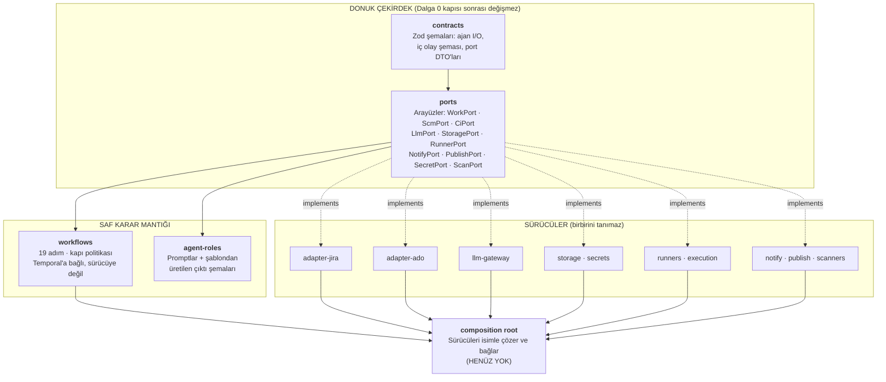

### Bu neden bu kadar önemli

Maestro'nun selefi (Orkestra v1) öldü çünkü parçalar tek tek makuldü ama bütün hiç
çalışmadı: üreten ile tüketen farklı anahtarlar kullanıyordu, bir uç 200 dönerken
karşı taraf olayı yok sayıyordu. Donuk sözleşme bu hata sınıfını **derleme zamanında**
kapatır.

Kurala kodda uyulduğunun kanıtı: `packages/workflows/src/worker.ts` port adlarını
**string olarak** taşır, sürücü paketlerinden import **etmez**:

```ts
export const PORT_NAMES = {
  work: "work",  scm: "scm",  llm: "llm",  scan: "scan",
  storage: "StoragePort",   // Tarihsel yazım — @maestro/storage'ın kaydettiği ad, birebir korundu
  secret: "secret",  notify: "notify",  publish: "publish",
} as const;
```

> [!NOTE]
> `@maestro/adapter-jira`'yı yalnızca portunun adının `"work"` olduğunu öğrenmek için
> import etmek, M44'ün yasakladığı bağlanmadır. Sapmayı derleme değil **test**
> yakalar: `test/worker.test.ts` bu çiftleri sürücü paketlerinin kendi sabitleriyle
> karşılaştırır, böylece bir yeniden adlandırma sessizce kayamaz.

### Port envanteri

| Port | Sorumluluk | Yazılmış sürücüler |
|---|---|---|
| `WorkPort` | Ticket okuma, yorum, label, atama, komut ayrıştırma, üyelik doğrulama | `jira-dc` |
| `ScmPort` | Repo çözümleme, branch, PR, thread, push kimliği | `ado` (çift mod) |
| `CiPort` | Build olayı ayrıştırma — **pasif**, tetiklemez | `ado` |
| `LlmPort` | `generateObject` + `agentSession` | `anthropic-direct` · `aws-bedrock` · `gcp-vertex` · `openai-compat` · `claude-sub` |
| `StoragePort` | put/get/list/delete/presign | `s3-compat` · `pg-blob` |
| `SecretPort` | `get` + `issueShortLived` | `vault` · `env-file` (dev) |
| `RunnerPort` | acquire/runSession/release/mountCache | `docker-linux` |
| `ScanPort` | Güvenlik taramaları | Zorunlu üçlü `gitleaks` · `semgrep` · `trivy` (M27) + opsiyonel `fortify` · `sonarqube` · `xray` (M77 — **yapılandırılana kadar `CapabilityNotSupportedError` atarlar**, yani kayıt bir söz vermez) |
| `NotifyPort` | Kanal bildirimi | `teams` · `smtp` · `jira-comment` · `slack` + `multi` (composite) |
| `PublishPort` | Analiz yayını | `jira-comment` · `confluence-page` · `repo-docs` + `multi`. `docx`/`pdf` **kayıtlı ama kurulum anında reddediliyor** |

> [!WARNING]
> **HENÜZ YOK:** `agent-macos` ve `agent-windows` runner sürücüleri (M21'in 3'te
> 2'si), `PublishPort`'un `docx`/`pdf` sürücüsü (M103r — bugün kurulum anında
> **reddediliyor**), `SecretPort`'un `cyberark`/`azure-keyvault` sürücüleri (M80),
> AD/LDAP kimlik sürücüsü (M8), ve **composition root'un kendisi**.

---

## 2. 19 adımlık akış

### 2.1 Tam akış diyagramı

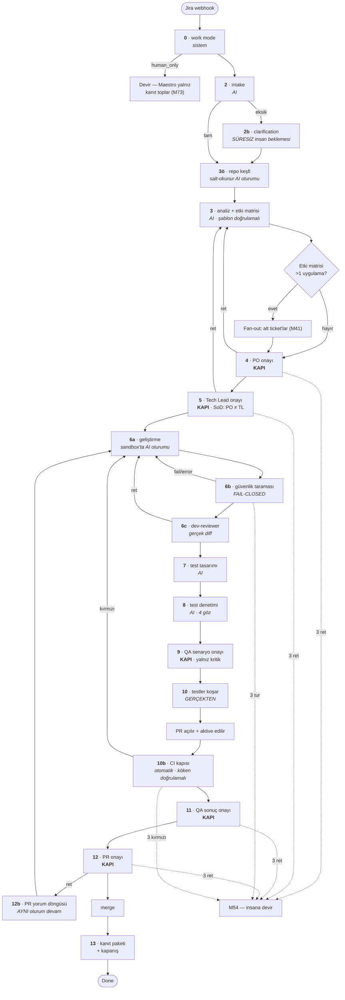

### 2.2 Adım türleri

`STEP_META` her adıma bir **tür** verir ve bu tür, adımın kim tarafından ilerletildiğini
söyler:

| Tür | Adımlar | Kim ilerletir |
|---|---|---|
| `system` | 0, 6b, 12b, 13 | Maestro |
| `ai` | 2, 3ö, 3, 6a, 6c, 7, 8, 10 | Model |
| `human_gate` | **4, 5, 9, 11, 12** | **İnsan onayı** |
| `human_wait` | **2b** | İnsan cevabı (onay değil) |
| `auto_gate` | 10b | ADO build validation sinyali |

### 2.3 Workflow'un üç garantisi

`ticket-workflow.ts` dosyasının başında yazılı olan ve her değişikliğin korumak
zorunda olduğu üç özellik:

**① Maliyetsiz bekler.** 16 gün açık kalan bir kapı bir `condition`'dır, poll değil.
Hiçbir şey otomatik onaylanmaz; hiçbir zaman aşımı bir karara dönüşmez — yalnız
hatırlatıcılar eskale eder.

**② Bağlam hayatta kalır.** Geliştirme, bir retten / CI hatasından / PR thread'inden
sonra **AYNI** ajan oturumuna döner (M30), ve `resumeToken` `continueAsNew` sınırının
ötesine input üzerinden taşınır — ret döngüsü bir **devam**, yeniden başlatma değil.

**③ Fail-closed durur.** Taramalar, CI kökeni, kapı yetkisi ve kill switch akışı
geçirmek yerine **durdurur**. İleri gitmenin tek yolu olumlu bir sonuçtur.

### 2.4 Determinizm kuralı

Workflow dosyasında `Math.random()`, `process.env` ve I/O **yoktur**; tek saat
okuması `workflowNow()` üzerindendir (Temporal sandbox'ı `Date.now()`'u deterministik
workflow zamanıyla değiştirir). Gerçek olan her şey bir **aktivite**, karar veren her
şey `gates.ts`'teki bir **saf fonksiyondur**.

### 2.5 `continueAsNew` — ret döngüsünün mimarisi

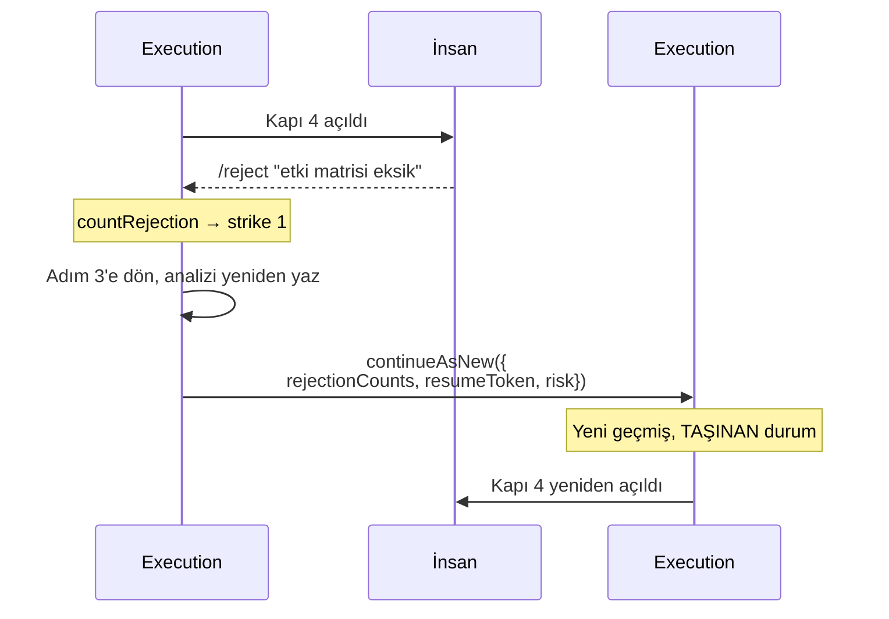

`TicketWorkflowInput` içinde `continueAsNew`'i **hayatta kalması gereken** üç alan
taşınır:

| Alan | Taşınmazsa ne olur |
|---|---|
| `rejectionCounts` | Sayaç sıfırlanır → **M54 hiç ateşlenmez** (5 ret → kapı 6 kez açılır) |
| `resumeToken` | **M30 ikinci rette kaybolur** — ajan bağlamı sıfırlanır |
| `risk` | Devam eden koşu **yanlış kapı setinden** geçer |

> [!WARNING]
> Bu bir tasarım tercihi değil, kapatılmış bir **kritik hatadır** (K4). Eski kod
> `ticketWorkflow(input)`'u aynı execution içinde özyinelemeli çağırıyordu: geçmiş
> şişiyordu (Temporal'ın olay limiti serttir) ve her yerel `let` varsayılanına
> dönüyordu. Üç garantinin ikisi sessizce ölüydü.

---

## 3. Kapılar ve görev ayrılığı (SoD)

### 3.1 Risk kademesi kapı setini belirler (M51)

| Risk | Onay kapıları | Sayı | İnsan teması |
|---|---|---|---|
| `dusuk` | 5, 12 | 2 | 3 |
| `orta` | 4, 5, 11, 12 | 4 | 5 |
| `kritik` | 4, 5, 9, 11, 12 | 5 | 6 |

İnsan teması sayısı kapı sayısından bir fazladır çünkü **2b her kademede olabilir**
ve o bir onay kapısı değil, süresiz bir beklemedir.

> [!NOTE]
> Masterplan'ın eski metni "kritik → 6 kapı" diyordu ve bu **2b'yi de sayıyordu**.
> Y4 bulgusuyla netleştirildi: onay kapısı sayısı 2/4/5'tir. `packages/contracts`
> değişmedi ve değişmeyecek.

**Riski analiz belirler.** PO **yükseltebilir, DÜŞÜREMEZ**; seçim audit'e yazılır.

### 3.2 Kapı kararı nasıl doğrulanır

`canCloseGate` saf bir fonksiyondur ve **her eksende fail-closed**'dur. Onay için
gereken yetki, retten **kasıtlı olarak daha katıdır**: akışı durdurmak yetki
gerektirmez, geçirmek gerektirir.

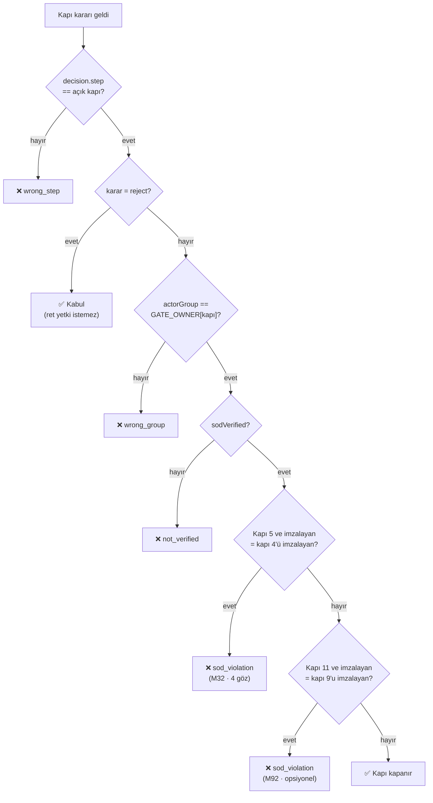

Reddedilen bir karar kapıyı **açık bırakır** ve sebep hem deftere hem ticket'a yazılır.

### 3.3 SoD matrisi (M32)

> **üreten (AI servis hesabı) ≠ onaylayan ≠ merge eden**

| Kural | Nerede uygulanır |
|---|---|
| Kapı 4'ü imzalayan, kapı 5'i imzalayamaz | `canCloseGate` — hard-check |
| QA senaryo onaylayan ≠ QA sonuç onaylayan | `canCloseGate` (M92, `sod.qa_split` parametresi, varsayılan **kapalı**) |
| Reviewer ≠ üreten | Reviewer ataması (M76) |
| Grup üyeliği **iddiaya değil dizine** sorulur | `WorkPort.verifyMembership` → Jira `group/member` |
| **AI kapı kapatamaz** | `GateDecision.source` yalnız `jira` \| `studio`; `maestro-mcp`'de kapı aracı yok |
| Bir AI, kullanıcının token'ıyla yazsa bile insana sayılır | `humanBehind()` — `ai-via:ugur@corp` → `ugur@corp` |

> [!IMPORTANT]
> Son satır bir bulguydu (B1): delegasyon token'ıyla verilen bir onay 4-gözün ikinci
> gözü sayılıyordu, yani tek kişi çift imzayı üretebiliyordu. Bugün `ugur@corp` ile
> `ai-via:ugur@corp` **tek çift göz**tür.

### 3.4 Kapı sahipleri

| Kapı | Grup | Ne onaylar |
|---|---|---|
| 4 | `product-owners` | Analizin işi doğru anladığı |
| 5 | `tech-leads` | Teknik yaklaşımın doğru olduğu |
| 9 | `qa` | Test senaryolarının yeterli olduğu |
| 11 | `qa` | Test **sonuçlarının** kabul edilebilir olduğu |
| 12 | `tech-leads` | PR'ın merge edilebilir olduğu |

Onayların **ana yolu Jira yorumudur**; Studio ikincildir.

---

## 4. Veri sınıflandırması ve PII sınırı

### 4.1 Üç veri sınıfı

`DataClass = ["acik", "dahili", "gizli"]`

Sınıf → arka uç eşlemesi **kodda değil politikadadır** (`dataclass.policy`
parametresi, M18/M63). `gizli` sınıf için on-prem model yoksa üç davranıştan biri
seçilir:

| Seçenek | Ne olur |
|---|---|
| `degrade_ai_assist` (**varsayılan**) | "Yapan" rol ai-assist'e düşer, insan kodlar (M97) |
| `block` | Akış durur |
| `masked_cloud` | Maskeli hâliyle buluta çıkar |

Bu seçimi **kurumun uyum ekibi** yapar; kurulumda doldurulur.

### 4.2 PII sınırı — LLM'e giden her şey maskelenir (M20/M82)

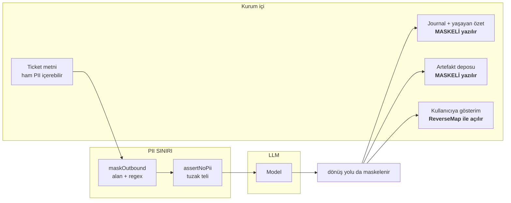

Kilit noktalar:

- Maskeleme **LLM sınırındadır**, sürücülerde değil — yeni bir hedef eklenince
  unutulamaz.
- **Dönüş yolu da denetlenir**: 10 yıl saklanacak kayıtta açık PII kalmaz.
- **ReverseMap yalnız anlık gösterimde** kullanılır; depoya asla maskesiz yazılmaz.
- Oturum jetonları **oturum nonce'u taşır** (`[TCKN_1.a3f9]`): yanlış oturum haritası
  **başkasının kimliğini** döndüremez, kullanıcı metnine jeton enjekte edilemez.
- Maskeli yük **nominal bir zarftır**: ham yükü geçirmeye çalışan kod **derlenmez**
  (`@ts-expect-error` ile pinlenmiş).
- Politika **dondurulur** (`Object.freeze`) ve **monotondur**: profil düşürme
  fail-open olamaz.
- Operatör regex'leri **yükleme anında ReDoS'a karşı denetlenir**.

> [!WARNING]
> Doğrulama turunda bulunan gerçek açıklar: **gizli veri 3 ayrı yoldan buluta
> çıkabiliyordu** (biri: ajanın ikinci denemesi maskesiz gidiyordu) · analizdeki ham
> kişisel veri **git geçmişine kalıcı commit ediliyordu** (git'ten silmek neredeyse
> imkânsızdır) · boşluklu TCKN (`TC: 123 456 789 50`) ve küçük harfli IBAN
> maskelenmiyordu · SMTP parolası hata mesajından base64 ile geri çözülebiliyordu.
> Hepsi kapatıldı.

> [!NOTE]
> **Bilinen sınır (B-14/B-15):** base64, HTML-entity, sıfır-genişlik ve fullwidth
> karakterlerle **gömülü** PII bugün yakalanmaz. Rapora yazıldı, gizlenmedi.

### 4.3 Test verisi kuralı (M95)

Sentetik veri **zorunludur**. PII desen taraması gerçek-veri-benzeri kalıpta uyarır ve
AI'ın ürettiği test verisi her zaman sentetiktir (persona kuralı).

---

## 5. LLM egress sınırı

### 5.1 Gateway korumaları (M19)

| Koruma | Davranış |
|---|---|
| Rate limit | Token-bucket (`TokenBucket`, `http.ts`) — **bugün süreç içidir**; M19'un istediği **Redis Lua ile atomik** sürüm **HENÜZ YOK** (Redis hiçbir pakette kullanılmıyor). Tek süreçte doğru, çok süreçli dağıtımda paylaşılmaz |
| Bütçe | Per-workflow + aylık; **tek doğruluk kaynağı**; %80 uyarı, %100 **stop** |
| Fiyat tablosu | Konfigürasyonda |
| **Bilinmeyen model** | **HATA** — sessiz fallback yok |
| Çağrı logu | **Maskeli** |
| Prompt cache | Zorunlu |

> [!IMPORTANT]
> "Sessiz fallback yok" kuralı v1'in **3× fiyat** hatasından doğdu: bilinmeyen bir
> model adı sessizce pahalı bir modele düşüyordu.

### 5.2 Egress proxy (M26) — tek çıkış

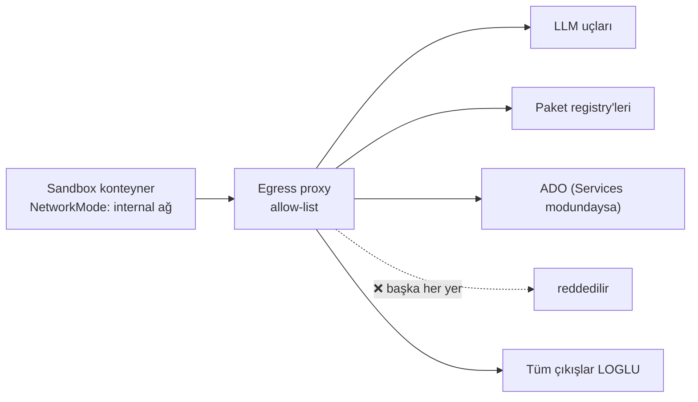

> [!WARNING]
> **Proxy ortam değişkeni bir kontrol DEĞİLDİR.** Sandbox'a `HTTP_PROXY`/`HTTPS_PROXY`
> enjekte edilir ve iş bunları ezemez — ama iş bu değişkenleri **okumak zorunda
> değildir**. Bir dönem rapor "iş kendi egress'ini yeniden yönlendiremez" diyordu ve
> bu **yanlıştı**: iş yeniden yönlendirmeye ihtiyaç duymuyordu, proxy'yi **yok
> saymak** yetiyordu. Canlı kanıt: sıradan bridge ağında `nc -w 3 -z 1.1.1.1 443`
> başarılıydı.
>
> **Ham TCP'yi kapatan tek şey ağın `Internal: true` olmasıdır** ve bu, ilk konteyner
> başlamadan önce daemon'a sorulur.

Kurum kendi proxy'sini kullanıyorsa Maestro'nunki ona **zincirlenebilir** (M64).

### 5.3 Model erişim yolları

| Yol | Ne zaman | Maliyet takibi |
|---|---|---|
| `claude-sub` (abonelik) | Birincil (M107) | **Kota/pencere** bazlı |
| `anthropic-direct` · `aws-bedrock` · `gcp-vertex` | API | Dolar bazlı bütçe |
| `openai-compat` | vLLM / on-prem / yedek | Yapılandırmaya göre |

Aktif sürücüler ve rol → model eşlemesi **tamamen konfigürasyondur**. Geçiş bir
konfigürasyon değişikliğidir, kod değişikliği değil.

---

## 6. Denetim izi (audit) zinciri

### 6.1 Yapı (M33)

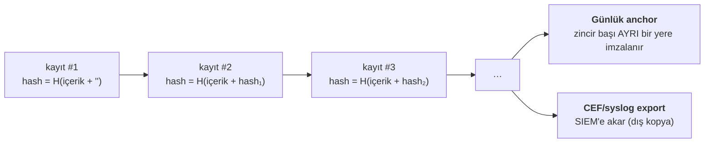

| Özellik | Değer |
|---|---|
| Algoritma | SHA-256 hash zinciri |
| Yazar | **Tek** — yalnız worker aktivitesi |
| Anchor | Günlük; zincir başı ayrı yere imzalanır |
| SIEM | **CEF formatlı syslog + dosya düşümü** — kurumdaki hedef sistemden bağımsız |
| Saklama | **10 yıl** (M56) |

CEF formatı seçimi bilinçlidir: Splunk/QRadar gibi toplayıcılar bunu zaten okur, yani
Maestro kurumun SIEM ürünü seçimine bağımlı değildir.

### 6.2 Zincir ne yakalar

| Saldırı | Tespit |
|---|---|
| Kayıt **silme** | `sequence_gap` — kaç kayıt eksik olduğu dahil |
| Kayıt **değiştirme** | `prev_hash_mismatch` |
| **Baştan** silme | Yakalanır (bir dönem yakalanmıyordu — kapatıldı) |

### 6.3 `signatureSeq` = zincirdeki sıra

Kapı kararı **önce zincire yazılır**, dönen `seq` imza numarası olur. Yani imza,
denetçinin göremediği bir sayaçtan değil, **zincirin kendisinden** gelir.

### 6.4 Aktör biçimi

| Biçim | Anlamı |
|---|---|
| `user@corp` | İnsan |
| `ai-via:<user>` | AI, o kullanıcının RBAC'ıyla çalışıyor |
| `maestro-worker` / `maestro-runner` | Sistem |

`GATE_APPROVE` / `GATE_REJECT` için **insan olmayan aktör reddedilir** — `ai-via:` bile.

### 6.5 Kanıt paketi (M34)

Adım 13'te üretilir ve şunları içerir: analiz + diff + test raporu + tarama sonuçları
+ **imzalı onay zinciri** + maliyet → tek arşiv (StoragePort).

> [!IMPORTANT]
> `buildEvidencePackage` **audit zincirini önce doğrular**; zincir kırıksa **paket
> üretilmez**. Denetime kırık bir kanıt paketi sunulamaz.

Change yönetimi bağlantısı **Jira üzerinden**dir: paket linki ticket'ta kalır, ticket
kurumun change kaydına referans verir (M34).

---

## 7. Hafıza — bağlam neden kaybolmaz (M30)

Üç katman:

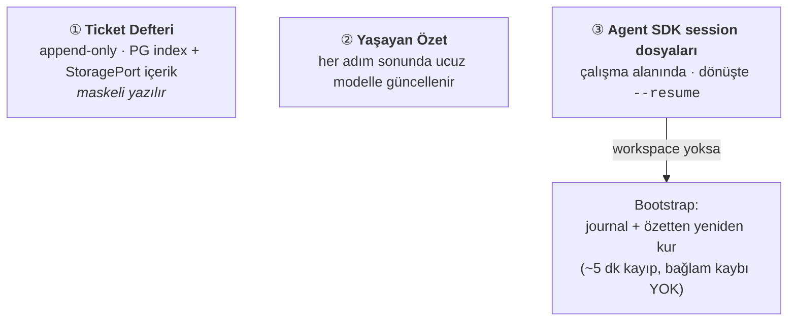

Her ret ve her CI döngüsü **önceki oturumun devamıdır**. Ajan sıfırdan başlamaz.

Cache üç katmanlıdır (M31):

| Katman | Ne | Ömür |
|---|---|---|
| ① | Bağımlılık (repo + lockfile) | Kalıcı |
| ② | Ticket çalışma alanı (klon + build + session) | Ticket ömrü; kapanış/iptalde **audit'li silme** |
| ③ | Knowledge + prompt cache | Kalıcı |

Katman ② runner diskinde **şifrelidir**: Linux'ta LUKS/fscrypt'li volume, Windows'ta
BitLocker'lı disk, macOS'ta FileVault'lu disk — dizin erişimi iş bazlı **ephemeral
kullanıcıyla** sınırlıdır.

---

## 8. Çoklu platform: fan-out (M41/M100)

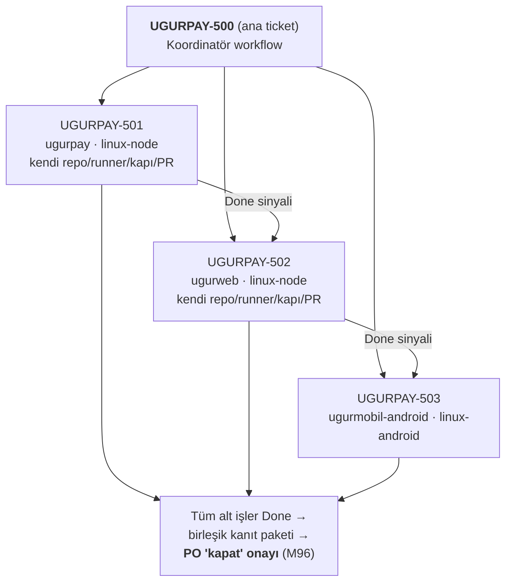

- Analizin **etki matrisi** birden çok uygulamaya dokunuyorsa Maestro alt ticket'lar açar.
- Her alt ticket **bağımsız bir Maestro akışıdır** — tek ticket/tek repo ilkesi korunur.
- **Bağımlılık sırası analizden gelir** (ör. önce API, sonra istemciler).
- Alt ticket tipi proje bazlıdır; varsayılan **ayrı story + "relates to" link** (M50).
- Etki matrisi diğer uygulamaları **klonlamadan**, repo kartlarından değerlendirir.

---

## 9. Yeni proje (greenfield) akışı (M42)

Repo yoksa ek adımlar devreye girer:

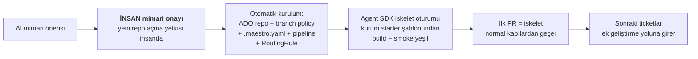

---

## 10. MCP mimarisi (M37/M101)

Dört MCP sunucusu:

| Sunucu | Kime | Ne verir |
|---|---|---|
| `jira-mcp` | Ajan oturumlarına | Ticket okuma/yorum — yetki filtreli |
| `ado-mcp` | Ajan oturumlarına | Repo/PR — yetki filtreli |
| `workspace-mcp` | Ajan oturumlarına | Ticket defteri oku/yaz, dosya arama |
| **`maestro-mcp`** | İnsan kullanıcılara | Platformun kendisini yönetmek |

`maestro-mcp` kapsamları:

| Kapsam | Ne yapabilir |
|---|---|
| `read` | Workflow durumu, journal, parametreler, kota, runner sağlığı, bekleyen kapılar |
| `operate` | Workflow başlat, uygulama ata, work-mode değiştir, duraklat/sürdür, adım retry, kapı sahibine hatırlatma |
| `admin-öneri` | Parametre değişikliği → **4-göz kuyruğuna**; kill-switch → **çift onay** |

> [!IMPORTANT]
> **`maestro-mcp`'de kapı onay/ret aracı YOKTUR.** Bekleyen kapıyı listeler ve
> özetler ama karar veremez. Bu bir isim filtresi değil, **yapısal** bir garantidir:
> `MaestroPlatform` arayüzünde kapı kararı veren bir metot **yoktur** — var olmayan
> bir şeyi araç çağıramaz. İkinci garanti: `GateDecision.source` yalnız `jira` |
> `studio` alabilir ve bir MCP oturumu ikisini de üretemez.

Kimlik = çağıran kullanıcının **kişisel token'ıdır**; araçlar o kullanıcının RBAC'ıyla
çalışır ve audit aktörü `ai-via:<kullanıcı>` olur.

---

## 11. Analiz şablonu mimarisi (M43/M83/M108/M109)

### 11.1 Şablon **veridir**, kod değil

`agent-roles` paketinin kalbi budur: Zod şeması da prompt da şablon verisinden
**çalışma zamanında** üretilir.

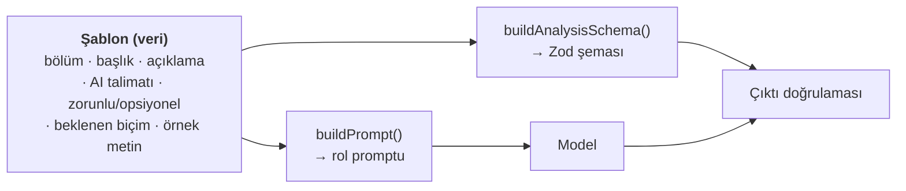

> [!IMPORTANT]
> **Studio'dan yeni bir bölüm eklemek kod değişikliği GEREKTİRMEZ.** Bunun kanıtı
> testtedir: şablona bir "Mevzuat etkisi" bölümü eklendiğinde hem şemanın hem
> promptun **kod değişmeden** değiştiği gösterilir.

Sekiz beklenen biçim: `free_text` · `bullet_list` · `field_group` · `list_group` ·
`table` · `impact_matrix` · `source_list` · `open_items`.

### 11.2 İki katmanlı doğrulama, ikisi de fail-closed

**① Şekil** — üretilen şemayla `safeParse`. Eksik zorunlu bölüm Türkçe ve bölüm adıyla
raporlanır.

**② Doğruluk** — şemanın göremediği kısım:

| Kontrol | Ne yapar |
|---|---|
| Kaynak zorunluluğu | Dolu her iddia bölümünün **Kaynaklar'da en az bir satırı** olmalı |
| Referans indeksi | Her referans, role **gerçekten gösterilen** bağlamda geçmeli — bağlamda olmayan referans = **uydurma → ret** |
| `placeholder` | `TODO`/`TBD`/`FIXME` ve Türkçe kaçamaklar (`…`, `...`, `-`, `x`) |
| İçerik kalitesi | Şekli doğru ama cevap olmayan bölüm reddedilir |

Üç ayrı hata kodu vardır çünkü düzeltme turunda model **hangisini yaptığını bilmelidir**.

> [!NOTE]
> Referans indeksine **örnek analizler de dahildir**, çünkü prompt onları modele
> **gösteriyor**. Gösterip kaynak göstermesine izin vermemek yanlış-pozitif
> üreticisidir: `ornek-analiz.md`'den alınan meşru bir kurum kuralı
> `source_fabricated` ile reddedilirdi ve model neden reddedildiğini anlayamazdı.

### 11.3 Sürüm pinlenmesi (M83)

Her akış **başladığı şablon sürümüyle biter**. Sürüm numarası ticket'a ve kanıt
paketine yazılır. Studio'da "hangi ticket hangi sürüm" raporu bulunur (**HENÜZ YOK**).

### 11.4 Doküman kalite standardı (M109)

Üretilecek analiz belgesinin hedef kalitesi, Uğur Yıldız'ın kendi hazırladığı
`UiPath-Orchestrator-HA-Plani-v1.0.pdf` referans belgesiyle **sabitlenmiştir**:
künye tablosu, numaralı bölümler, koyu başlıklı karşılaştırma tabloları, altyazılı
mimari şekiller (`Şekil N — …`), uyarı kutuları, kod blokları ve kaynakça.

> [!WARNING]
> **HENÜZ YOK:** `docx`/`pdf` render sürücüsü (M103r) ve **SVG şekil üretimi**
> (etki matrisi, akış şeması, fan-out ağacı). Bugün bunlar metin ve tablo olarak
> vardır, şekil olarak yoktur. `PublishPort`'un `docx`/`pdf` hedefleri **kurulum
> anında reddedilir** — sessizce boş dosya üretmez.

---

## 12. Dil mimarisi (M59/M60/M104)

| Ne | Dil |
|---|---|
| Analiz, Jira yorumları, kapı özetleri | **Türkçe** (parametrik: `lang.output`) |
| Kod, commit mesajı, PR başlığı, test adları | **İngilizce** — parametrik **değil** |
| Studio arayüzü | TR / EN (dil seçici) |

Kullanıcıya dönük **tüm** metinler merkezi bir **mesaj kataloğunda** yaşar
(`packages/config/locales/{tr,en}.json`). Yeni dil eklemek = katalog dosyası eklemek;
kod değişikliği yok.

> [!IMPORTANT]
> Katalog **fail-closed** doğrulanır: BFF açılışta kataloğu denetler ve **render
> edemediği bir cümleyi borçlu olan servis trafiği kabul etmez** (M6 ruhu). Eksik
> anahtar, adı açıkça bir muafiyet listesinde geçmiyorsa servisi açtırmaz.

---

## 13. Ölçek ve dağıtım (M39/M94)

| Konu | Karar |
|---|---|
| Kuyruk | Role-based Temporal task queue + havuz semaforları |
| Pilot hedefi | 10-30 ticket/gün |
| Mimari hedef | 100+ eşzamanlı |
| Backpressure | Jira'ya "queued" bildirimi |
| Durum | **Tüm servisler stateless** — durum PG/Redis/Storage'da |
| OpenShift | Helm chart Aşama 3'te taslak; geçiş ayrı karar |
| Sürüm | 2 haftada bir, mesai dışı; Temporal versioning ile çalışan workflow'lar kesilmez |

---

## 14. Kapsam dışı — bilerek

Bunlar eksiklik değil, **karar**dır (masterplan §1.2):

- Çoklu Git sağlayıcı (Bitbucket/GitHub/GitLab — **port hazır**, sürücü yazılmaz)
- Multi-tenant
- Ticari paketleme / lisanslama sistemi
- Atlassian Marketplace
- Epic/inisiyatif seviyesi portföy yönetimi (**çok platformlu işler M41 ile kapsamda**)
- Otomatik knowledge öğrenme (feedback portu veri toplar, işleme v2)
- Gerçek iOS cihaz / TestFlight (**simulator-only**)
- Prometheus/Grafana tam gözlemlenebilirlik (Aşama 3 sonrası)
- Air-gap paketleme
- ServiceNow benzeri change sistemi entegrasyonu (bağlantı **Jira üzerinden**)

---

## 15. Kabul edilmiş riskler

Bunlar açık soru değil, **izlenen ve kabul edilmiş** risklerdir:

| Risk | Kabul / azaltma |
|---|---|
| mac/win'de konteyner izolasyonu yok | M25 telafi seti (ephemeral kullanıcı, dar haklar, MDM/EDR, aynı egress, audit'li temizlik) — **kabul edilen risk kaydı** |
| Agent SDK = Claude bağımlılığı ("gizli" sınıfta) | M18 politikası: degrade/block seçeneği; on-prem sürücü hazır |
| Mac tedarik / MDM gecikmesi | Aşama 3 giriş kriteri; iOS'a kadar 4 uygulama canlı |
| ADO Server API sürüm farkları | Çift-mod contract testleri + pilot öncesi duman testi |
| LLM maliyet sapması | Gateway bütçesi hard-stop + günlük maliyet raporu |
| Kurum ağ/proxy sürprizleri | Aşama 0'da ilk iş: ağ yolu doğrulama script'i |

---

## 16. Netleştirilecek açık maddeler

Bu doküman "her şeyi biliyorum" numarası yapmaz. Bugün cevabı olmayan maddeler:

1. **`GATE_OWNER` parametrikleştirmesi** — kapıyı farklı **türde** bir sahibe
   yönlendirmek bugün mümkün değil. `ParamReader.gateOwners` gerekiyor ve **ikinci
   proje onboard edilmeden önce** yazılmalı.
2. **Proje üyeliği adlandırma kuralı** — `maestro-<projectkey>` kuralı koda gömülü.
   Kurumun AD şeması bununla uyuşuyor mu?
3. **Redis'in yeri** — M4 kararı var, kod yok. Kapasite semaforu ve atomik rate limit
   Redis'e mi taşınacak, yoksa Temporal/Postgres ile mi çözülecek?
4. **`StoragePort` akış (stream) kararı** — kanıt paketleri yüzlerce MB olabilir;
   `getStream`/`putStream` eklenecek mi?
5. **`.maestro.yaml` yükleyicisi** — dosyanın tam şeması ve ayrıştırıcısı henüz kodda
   yok; yalnız `protected_paths` semantiği gerçek.
6. **Çok worker'lı idempotency** — tablo destekli guard ne zaman yazılacak?
7. **Analiz belgesinin `docx`/`pdf` çıktısı** (M103r) ve **SVG şekil üretimi** (M109)
   — birinci sınıf gereksinim olarak tanımlandı, henüz yazılmadı.
8. **On-prem GPU / vLLM** — gelirse `gizli` sınıf davranışı değişir; gelmezse
   `degrade_ai_assist` kalıcı olur.

---

## 17. Kaynaklar

Bu dokümandaki her iddianın dayanağı:

| Bölüm | Kaynak |
|---|---|
| §1 katman kuralı, port envanteri | `packages/ports/src/*.ts` · `packages/workflows/src/worker.ts` (`PORT_NAMES`) · masterplan M44 |
| §2 19 adım, adım türleri | `packages/contracts/src/workflow.ts` (`STEP_IDS`, `STEP_META`) |
| §2.3 workflow garantileri | `packages/workflows/src/ticket-workflow.ts` (dosya başı yorumu) |
| §2.5 `continueAsNew` | `packages/workflows/RAPOR.md` §0 (K4) |
| §3 kapılar, SoD | `packages/workflows/src/gates.ts` (`GATE_OWNER`, `canCloseGate`) · `GATES_BY_RISK` · masterplan M32/M51/M92 |
| §3.1 kapı sayısı netleştirmesi | `packages/workflows/RAPOR.md` §Y4 |
| §4 veri sınıfı, PII | `packages/contracts/src/common.ts` (`DataClass`) · `packages/pii/RAPOR.md` §0 · masterplan M18/M20/M63/M82/M95 |
| §5 LLM egress | `packages/llm-gateway/src/http.ts` (`TokenBucket`) · `packages/runners/RAPOR.md` §2 · masterplan M19/M26/M55/M64 |
| §6 audit zinciri | `packages/audit/RAPOR.md` · `apps/bff/RAPOR.md` §Denetim · masterplan M33/M34/M56/M57 |
| §7 hafıza | masterplan M30/M31/M65 · `packages/memory` |
| §8 fan-out | masterplan M41/M50/M96/M100 |
| §9 greenfield | masterplan M42 |
| §10 MCP | `packages/mcp-servers/RAPOR.md` §0 · masterplan M37/M101 |
| §11 analiz şablonu | `packages/agent-roles/RAPOR.md` §1-3 · masterplan M43/M83/M108/M109 · `plan/referans/DOKUMAN-STANDARDI.md` |
| §12 dil | `packages/config/locales/{tr,en}.json` · masterplan M59/M60/M104 |
| §13 ölçek | masterplan M39/M94 |
| §14 kapsam dışı | masterplan §1.2 |
| §15 riskler | masterplan §7 |

---

## 18. Doküman kontrolü

| Versiyon | Tarih | Değişiklik |
|---|---|---|
| v1.0 | 09.08.2026 | İlk yayın — Dalga 3 sonrası kod durumuna göre yazıldı; `HENÜZ YOK` maddeleri işaretlendi |

| Rol | Ad / Ekip | Tarih | İmza |
|---|---|---|---|
| Hazırlayan | Maestro doküman ajanı | 09.08.2026 | |
| Kontrol eden | | | |
| Onaylayan | | | |

---

## 19. Devamı

- Güvenlik kontrollerinin **neden** var olduğu → [`guvenlik.md`](guvenlik.md)
- İşletim prosedürleri → [`operasyon-runbook.md`](operasyon-runbook.md)
- Karar gerekçeleri → [`../plan/masterplan.md`](../plan/masterplan.md)
