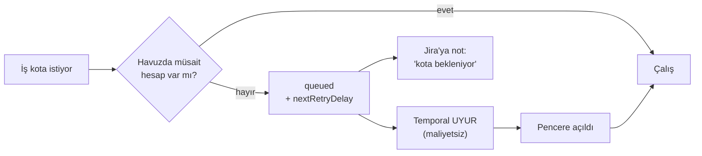

# Maestro — Operasyon El Kitabı (Runbook)

*Kapı · takılma · kill switch · runner · kota · CI · yedekleme · alarm→aksiyon*

| Hazırlayan | Tarih | Versiyon | Kapsam |
|---|---|---|---|
| Maestro doküman ajanı | 09.08.2026 | v1.0 | Olay bazlı müdahale prosedürleri · kill switch kullanımı · runner ve kota yönetimi · yedekleme/geri dönüş · alarm→aksiyon tablosu · sürüm ve bakım. **Tatbikatla doğrulanmamıştır** (bkz. aşağıdaki uyarı) |

> **Kime:** platform ekibi, nöbetçi operatör, Maestro admin'i.
> **Ön koşullar:** [`kurulum.md`](kurulum.md) ve [`jira-baglama.md`](jira-baglama.md)
> okunmuş olmalı. Kill switch bölümü için `admin` rolü gerekir.
> **Destek modeli:** işletim platform takımındadır; **mesai içi destek** (M87).
> 7/24 kararı Aşama 3'e bırakılmıştır.

> [!WARNING]
> **Bu runbook henüz tatbikatla doğrulanmamıştır.** Masterplan'a göre runbook'un
> tatbikatla doğrulanması **Aşama 3 çıkış kriteridir**; restore tatbikatı ise
> **Aşama 1 çıkış kriteridir** (M66) ve henüz yapılmamıştır. Aşağıdaki prosedürler
> koddaki gerçek davranışa dayanır, ama sahada koşturulmamıştır.
>
> Ayrıca birçok işlem **Studio'dan** yapılır ve `apps/studio` **HENÜZ YOK**.
> BFF'in REST uçları yazılmış ve testlidir; onları çağıran arayüz yazılmamıştır.
> BFF'in çalıştırıcı kökü de (`apps/bff/src/main.ts`) **HENÜZ YOK**.

---

## 1. Hızlı karar tablosu

| Belirti | İlk bakılacak | Bölüm |
|---|---|---|
| Ticket kapıda bekliyor, kimse onaylamıyor | Hatırlatıcı merdiveni çalışıyor mu | [§2](#2-kapı-bekliyorsa) |
| Koşu ilerlemiyor, adım değişmiyor | Hangi adımda takıldığı | [§3](#3-koşu-takıldıysa) |
| Aynı kapıdan 3 ret / aynı CI hatası 3 kez | Otomatik devir zaten olmalıydı | [§3.3](#33-m54-takılma-koruması) |
| Şüpheli davranış, acil durdurma | Kill switch seviyesi | [§4](#4-kill-switch) |
| Runner düştü / iş kabul etmiyor | Lease ve heartbeat | [§5](#5-runner-düştüğünde) |
| "Kota bekleniyor" notu | Abonelik havuzu penceresi | [§6](#6-kota-bittiğinde) |
| CI sinyali gelmiyor | Köken doğrulaması reddediyor olabilir | [§7](#7-ci-sinyali-gelmiyorsa) |
| Tarama akışı durdurdu | `scan.block_level` ve fail-closed | [§3.4](#34-tarama-akışı-durdurduysa) |
| Veri kaybı / geri dönüş | Yedekleme ve restore | [§8](#8-yedekleme-ve-geri-dönüş) |

---

## 2. Kapı bekliyorsa

### 2.1 Bu genelde bir arıza değildir

> [!IMPORTANT]
> **İnsan kapıları süresiz bekler** (M29). Bu bir tasarım kararıdır, bir hata değil.
> 15-20 gün bekleyen bir kapı **doğal durumdur**. Hiçbir kapı otomatik onaylanmaz,
> hiçbir zaman aşımı bir karara dönüşmez. Bekleme Temporal'ın `condition`'ıdır —
> poll değil, yani beklemek **maliyetsizdir**.

Bunun bir testi vardır ve kapıda koşar: *"a gate open for sixteen days waits without
deciding, reminds all along, and closes only on a human"* — 384 saatlik hatırlatıcı
tetiklenir, otomatik onay olmaz, kapıyı yalnız insan kapatır.

### 2.2 Hatırlatıcı merdiveni (M88)

Varsayılan merdiven (`escalation.ladder` parametresi):

| Adım | Ne zaman | Kanal | Ne olur |
|---|---|---|---|
| `reminder-24h` | 24 saat sonra | **Jira** | Kapı sahibine hatırlatma yorumu |
| `escalation-72h` | 72 saat sonra | **Teams** | Eskalasyon bildirimi |
| `delegate-7d` | 7 gün (168 saat) sonra | **SMTP** | **Vekile devredilir** (`action: delegate`) |

`businessHoursOnly` varsayılan olarak `false`'tur. Merdivenin adımları, kanalları ve
mesai/tatil takvimi tamamen parametriktir.

> [!WARNING]
> **Merdivenin tek doğruluk kaynağı veritabanıdır.** Bir dönem `notify` paketinde
> ikinci bir varsayılan vardı ve ikisi ayrışmıştı; bu bir doğrulama turunda bulundu
> ve kaldırıldı. Merdiveni değiştirirken **yalnız** `escalation.ladder` parametresine
> dokunun.

> [!NOTE]
> Merdiven adımlarının **kalıcı `id`**'si vardır (`reminder-24h` gibi) ve workflow
> hangi adımların tetiklendiğini bu id ile hatırlar. Id içerikten türetilseydi,
> Studio'dan eşiği 72s'ten 48s'e düşürmek yeni bir id üretir ve **açık her kapıyı
> anında yeniden eskale ederdi**. Bu yüzden id'yi düzenlerken değiştirmeyin.

### 2.3 Operatör ne yapabilir

| İstenen | Nasıl |
|---|---|
| Kapı sahibine hatırlat | `maestro-mcp` `operate` kapsamı: "kapı sahibine hatırlatma" aracı |
| Bekleyen kapıları listele | `maestro-mcp` `read` kapsamı veya `GET /runs` |
| Vekil tanımla | Studio'da tarih aralıklı **delegasyon kaydı** (audit'li) — **HENÜZ YOK** (arayüz) |

> [!IMPORTANT]
> **Operatör kapıyı kapatamaz.** Ne Studio'dan bir "admin onayı" düğmesiyle, ne de
> MCP üzerinden. `maestro-mcp`'de **kapı onay/ret aracı yoktur** (M101) — bekleyen
> kapıyı listeler ve özetler ama karar veremez. Onay yalnız insan kanalından gelir
> (Jira yorumu veya Studio) ve `GateDecision.source` yalnız `jira` | `studio`
> alabilir. Bir MCP oturumu ikisini de üretemez. M32 SoD böyle korunur.

### 2.4 Onay reddediliyorsa — dört sebep

Kapı kapanmıyorsa `canCloseGate` dört nedenden biriyle reddetmiştir:

| Sebep | Anlamı | Çözüm |
|---|---|---|
| `wrong_step` | Karar başka bir kapıya ait | Doğru kapıda onaylayın |
| `wrong_group` | Kişi o kapının sahip grubunda değil | Grup üyeliğini düzeltin |
| `not_verified` | SoD doğrulaması yapılmamış | Kimlik/dizin bağlantısını kontrol edin |
| `sod_violation` | 4. kapıyı imzalayan 5.'yi de imzalamaya çalışıyor | **Farklı kişi** imzalamalı (M32) |

Varsayılan kapı sahipleri (`GATE_OWNER`):

| Kapı | Sahip grup |
|---|---|
| 4 (PO onayı) | `product-owners` |
| 5 (TL onayı) | `tech-leads` |
| 9 (QA senaryo) | `qa` |
| 11 (QA sonuç) | `qa` |
| 12 (PR onayı) | `tech-leads` |

> [!WARNING]
> **`GATE_OWNER` bugün parametrik DEĞİLDİR** — koda gömülüdür. Grup adları
> `DirectoryReader.membersOf` dikişiyle kurumun dizinine yönlendirilebilir, ama
> **5. kapıyı farklı TÜRDE bir sahibe yönlendirmek** bugün mümkün değildir. Bunun
> için `ParamReader.gateOwners` gerekir ve **ikinci proje onboard edilmeden önce**
> yazılmalıdır. Kodda bu not yazılıdır (D7).

---

## 3. Koşu takıldıysa

### 3.1 Önce: gerçekten takıldı mı?

Bu adımlar **uzun sürmek üzere tasarlanmıştır** — takılma değildir:

| Adım | Normal süre |
|---|---|
| `2b` clarification | Süresiz — insan cevaplayana kadar |
| `4`, `5`, `9`, `11`, `12` | Süresiz — insan onaylayana kadar |
| `6a` geliştirme | Saatler olabilir (`longActs`: 4 saat bütçe) |
| `10b` CI kapısı | Platform başına 30-60 dk (`build.timeout_min`) |
| Kota beklemesi | Pencere açılana kadar — **haftalarca** olabilir (M55) |

Adım ve durum sorgusu:

```
Jira yorumuna:  /status
REST:           GET /runs/:ticket
```

`GET /runs/:ticket` Temporal'ın `runState` query'sini çağırır ve `{runId, ticketKey,
step, status, risk, startedAt, updatedAt}` döner.

> [!NOTE]
> `updatedAt` **her adım geçişinde** ilerler. Bir dönem hep `startedAt`'i
> raporluyordu, yani altı saattir çalışan bir koşu Studio'da "hiç dokunulmamış"
> görünüyordu (D1 bulgusu). Bugün `updatedAt` durgunsa koşu gerçekten durgundur.

### 3.2 Adım bazlı ilk bakılacaklar

| Takıldığı adım | Muhtemel sebep | Bakılacak |
|---|---|---|
| `0` | Kill switch `intake_only` veya `all` | [§4](#4-kill-switch) |
| `2` / `3` | LLM kotası doldu, kuyrukta | [§6](#6-kota-bittiğinde) |
| `2b` | Reporter cevap vermedi | Normal — hatırlatıcılar çalışıyor |
| `3` | Analiz **reddediliyor** olabilir (şablon/kaynak doğrulaması) | Defterdeki ret sebebi |
| `4`/`5`/`9`/`11`/`12` | Onay bekleniyor | [§2](#2-kapı-bekliyorsa) |
| `6a` | Runner yok / kapasite dolu / oturum uzun | [§5](#5-runner-düştüğünde) |
| `6b` | Tarama fail-closed durdurdu | [§3.4](#34-tarama-akışı-durdurduysa) |
| `10b` | CI sinyali gelmiyor veya reddediliyor | [§7](#7-ci-sinyali-gelmiyorsa) |
| `13` | Audit zinciri doğrulaması kırık | [§9](#9-denetim-izi-doğrulaması-kırıksa) |

### 3.3 M54 takılma koruması

Şu iki durumda iş **otomatik olarak** insana devrolur:

- Aynı kapıdan **3 ret**, veya
- Aynı CI hatası **3 kez**

Devir `ai_assist` moduna düşürür ve **tüm bağlam + defter** ile insana verilir; Jira'ya
özet yazılır. Eşik `stuck.threshold` parametresiyle ayarlanır:

```json
{ "gateRejections": 3, "ciFailures": 3, "action": "handover_ai_assist" }
```

> [!NOTE]
> Sayaç `continueAsNew` sınırını **aşarak** taşınır (workflow input'unda). Bir dönem
> workflow kendini özyinelemeli çağırdığı için sayaç her turda sıfırlanıyordu ve M54
> **hiç ateşlenmiyordu** — 5 ret sonrası kapı 6. kez açılıyordu. Bu K4 bulgusuyla
> kapatıldı.

Devrolmuş bir koşunun durumu `handover`'dır (`fail` değil). Bir dönem `blocked`
dalında `status` hiç atanmadığı için Studio "başarısız" gösteriyordu (O4).

### 3.4 Tarama akışı durdurduysa

Adım 6b (gitleaks + semgrep + trivy) **fail-closed**'dur:

- Tarama **başarısız** olursa akış durur.
- Tarama **hata verirse** de akış durur. Sürücü istisna atsa bile `error` sonucu
  üretilir — aktivite hata verip koşuyu düşürseydi tarama kaydı hiç oluşmazdı ve
  kanıt paketi eksik kalırdı.

Blok eşiği `scan.block_level` (varsayılan `high`, **guarded** parametre — 4 göz ister).

> [!WARNING]
> İki gerçek açık burada bulundu ve kapatıldı:
> 1. **Sır tarayıcısı gerçek araçla hiç çalışmıyordu** — her tarama hata dönecekti,
>    yani güvenlik kapısı hiçbir işi geçirmeyecekti.
> 2. **Boş klasör taranınca üç tarayıcı da "temiz" diyordu** — mount yanlışsa kapı
>    sıfır kapsamla açılıyordu.
>
> Bugün 10 **gerçek-araç duman testi** vardır (`MAESTRO_SCANNERS_IT=1`). Tarama
> yapılandırmasını değiştirdikten sonra bunları koşturun.

Bulgular kanıt paketine yazılır (M27). Blok seviyesinin altındaki bulgular PR'da not
olarak listelenir.

### 3.5 Korumalı yol ihlali (M52)

AI, `.maestro.yaml`'daki `protected_paths` listesindeki bir yola diff üretirse akış
**ilk turda** durur ve insana devrolur. Üç deneme hakkı **yoktur** — bu bilinçli.

Migration ve secrets varsayılan olarak korumalıdır. Liste ayrıca ADO CI dosyalarını,
`.git/hooks/` (iç içe olanlar dahil), husky ve `.vscode` yollarını kapsar.

---

## 4. Kill switch

### 4.1 İki seviye (M58)

| Seviye | Ne yapar | Ne yapmaz |
|---|---|---|
| `intake_only` | **Yeni iş alınmaz** | Başlamış koşular devam eder |
| `all` | **Her şey durur** — sandbox'lar güvenli söndürülür | **Kapılar bekler kalır** (terk edilmez) |
| `off` | Normal çalışma | |

### 4.2 Ne zaman kullanılır

| Durum | Seviye |
|---|---|
| Şüpheli model davranışı, incelemek istiyorsunuz | `intake_only` |
| Bakım penceresi / sürüm çıkışı | `intake_only` |
| Kredi/kota yönetimi | `intake_only` |
| **Güvenlik olayı** | `all` |
| Yanlış yapılandırma canlıya çıktı | `all` |
| Bir sandbox'ın kaçtığından şüpheleniyorsunuz | `all` |

### 4.3 Nasıl basılır

```
POST /killswitch     { "level": "all" }      # rol: admin
GET  /killswitch                             # mevcut durum
```

- **Rol `admin` zorunlu**, **insan kanalı** zorunlu, **audit** kaydı zorunlu.
- `killswitch.state` **guarded** bir parametredir: `off`'a geri dönmek bir kontrol
  kararıdır ve **iki farklı kişinin aynı değeri onaylaması** gerekir.
- `all` seviyesinde koşan **tüm** workflow'lara `killSwitch` sinyali gider.
- Studio'da duyurulur ve Jira'ya bildirim düşer.

### 4.4 Kill switch ne kadar sert durur — bilinmesi gerekenler

> [!IMPORTANT]
> **Merge durur.** Bu, doğrulama turunda kapatılan **kritik** bir açıktı (K1): son
> kapı onayı alındıktan sonra `mergePullRequest` → `buildEvidencePackage` →
> `closeTicket` zinciri kontrolsüz koşuyordu. Yani sistemdeki **tek geri alınamaz
> eylem** acil durdurmayı dinlemiyordu. Bugün 13. adımdan hemen önce bir kontrol
> daha vardır ve negatif iddialı bir test bunu çiviler.

> [!IMPORTANT]
> **Adım zinciri durur.** İkinci kritik bulgu (K2): kontrol yalnız döngü başlarındaydı,
> bu yüzden kill sonrası taramalar, incelemeler ve test koşumları devam ediyordu —
> hepsi yeni sandbox işi. Bugün kontrol `goto()` **içindedir**, yani **her adım
> geçişinde** koşar.

> [!NOTE]
> `intake_only` bir dönem **tamamen ölüydü** — yazılıyor, hiç okunmuyordu (K3, sessiz
> fail-open). Bugün: adım 0'daysa koşu **durur**; başlamış koşuda **deftere yazılır**
> ("seviye ① — başlamış koşu etkilenmez"). Sessizlik yok.

### 4.5 Kill switch açıkken komutlar

| Komut | `intake_only` | `all` |
|---|---|---|
| `/approve`, `/reject` | ✅ kabul | ✅ **kabul** |
| `/mode-change`, `/ai-takeover`, `/ai-start`, `/ai-assign` | ✅ kabul | ❌ reddedilir |

`all` seviyesinde bile kapı kararları kabul edilir: açık bir kapıda bekleyen insanı
ortada bırakmak olayı büyütür.

---

## 5. Runner düştüğünde

> [!WARNING]
> Bugün yalnız **`docker-linux`** sürücüsü yazılmıştır. `agent-macos` ve
> `agent-windows` sürücüleri ve **Runner Agent daemon'u (`apps/runner-agent`)
> HENÜZ YOK**. `packages/runners` yalnız protokol **şemasını** içerir
> (`AgentRegister` / `AgentHeartbeat` / `AgentBye`); sunucu/dinleyici yazılmamıştır.

### 5.1 Belirtiler

| Belirti | Anlamı |
|---|---|
| `RunnerCapacityError` | Platform için boş slot yok — **kuyruk yoktur**, fail-closed |
| `RunnerLeaseError` | Lease sahibi uyuşmuyor / süresi dolmuş |
| Heartbeat kesildi | Ajan makinesi düştü veya ağ koptu |
| `exitCode = 124` | Konteyner **zaman aşımına uğradı** ve SIGKILL ile öldürüldü |

### 5.2 Kontrol sırası

1. **Havuz görünümü** — `RunnerPool.snapshot()`: platform başına slot, meşgul/boş.
2. **Docker erişimi** — `ping`. Docker yetkisi yalnız **Runner Servisi'ndedir**
   (M24); worker'da `docker.sock` **asla** olmaz.
3. **Egress ağı** — konteyner başlamadan önce ağın **gerçekten `Internal: true`**
   olduğu daemon'a sorulur. Ağ yanlış yapılandırıldıysa iş **hiç başlamaz**. Bu bir
   arıza değil, kasıtlı bir kapıdır.
4. **İmaj dijesti** — imaj `repo@sha256:…` biçiminde olmalı. Tag'li imaj reddedilir.
5. **Lease tablosu** — `AgentRegistry`: kayıt kimlik doğrulamalı, devralma kuralı
   açık, lease platform sahipli.

### 5.3 Zaman aşımı davranışı

`runSession`, konteynerin çıkışını enjekte edilen zamanlayıcıyla **yarıştırır**.
Bütçe kazanırsa konteyner **SIGKILL** ile öldürülür, loglar yine çekilir ve **kısmi
çıktı** `exitCode = 124` ile döner (`timeout(1)` konvansiyonu). **Sessizce takılma
yoktur.**

Zaman aşımı bütçesi `maxTimeoutSeconds` tavanının üstündeyse **kırpılmaz, reddedilir**.

### 5.4 Workspace temizliği

| Durum | Ne olur |
|---|---|
| İş bitti | Workspace ticket ömrünce durur (cache katmanı ②) |
| Ticket kapandı / iptal / ret | **Audit'li ANINDA silinir** (M89) |
| 60 gün hareketsiz | Diskten silinir; session + journal StoragePort arşivinde kalır (M65) |
| Arşivden dönüş | Journal + özetle bootstrap — ~5 dk kayıp, **bağlam kaybı yok** |

Yaş sınırı `workspace.max_age_days` (varsayılan 60).

> [!NOTE]
> Journal, audit ve kanıt arşivi **silinmez** — saklama politikasına tabidir (10 yıl).
> Silinen yalnız çalışma alanıdır.

---

## 6. Kota bittiğinde

### 6.1 Abonelik havuzu (M55/M107)

Token-API pahalı olduğu için Claude/Gemini/Codex **abonelik hesapları** LlmPort'a ayrı
bir sürücü tipi olarak girer. Maliyet takibi dolar değil **kota/pencere** bazlıdır
(5 saatlik pencere, haftalık limit vb.).

`claude-sub` sürücüsü **API anahtarı kullanmaz**: makinede kurulu **Claude Code CLI**'yi
non-interaktif modda sürer ve `--resume` ile oturumu devam ettirir.

### 6.2 Havuz doluysa ne olur



- Gateway pencereyi izler, **dolu hesabı pas geçer**.
- Hepsi doluysa iş kuyruğa girer; Temporal bekler, pencere açılınca devam eder.
- Jira'ya "kota bekleniyor" notu düşer.

> [!IMPORTANT]
> **Düşünen roller için yeniden deneme bütçesi SINIRSIZDIR** (`POSITIVE_INFINITY`).
> Bu bilinçlidir: 50 deneme merdiveni ~50 saatte tükenir, ama **haftalık** bir
> abonelik kotası meşru olarak daha uzun sürebilir — "pazartesi gel" denen bir koşu
> cumartesi düşürülmemelidir.
>
> Sonsuz retry tehlikesi yoktur: kota hatası `nextRetryDelay` ile **pencerenin
> gerçek açılma anını** taşır, koşu o ana kadar uyur ve **hiçbir maliyeti yoktur**.
> Kota dışı her hata zaten `nonRetryable`'dır ve ilk denemede durur.

> [!WARNING]
> Temporal SDK'sında `maximumAttempts: 0` **"sınırsız" DEMEK DEĞİLDİR** —
> `compileRetryPolicy` onu reddeder ve koşu **ilk düşünme çağrısında** ölür. SDK'nın
> "sınırsız" yazımı `POSITIVE_INFINITY`'dir (alanı düşürür). Bunu uçtan uca bir test
> yakaladı; retry politikasına dokunacaksanız bu tuzağı bilin.

### 6.3 Operatör ne yapabilir

| İstenen | Nasıl |
|---|---|
| Havuza hesap ekle | `SubscriptionAccount` kaydı — Studio'dan (**HENÜZ YOK**) |
| Kota durumunu gör | `maestro-mcp` `read` kapsamı: kota görünümü |
| Uyarı eşiğini değiştir | `quota.warn_pct` parametresi (varsayılan **%80**) |
| Kuyruğu kapat | `subscription.queue_enabled` parametresi |

%80'de uyarı gider, **%100'de durur** (M19). Uyarı, operatörün havuzu zamanında
takviye edebilmesi içindir.

### 6.4 Bütçe (API sürücüleri için)

- Per-workflow + aylık bütçe, **tek doğruluk kaynağı** gateway'dedir.
- Fiyat tablosu konfigürasyondadır.
- **Bilinmeyen model = hata.** Sessiz fallback **yoktur** — v1'in 3× fiyat hatası
  buradan geliyordu.
- Çağrı logu **maskelidir**.

---

## 7. CI sinyali gelmiyorsa

### 7.1 Önce: reddedilmiş olabilir (M106)

Bir `build.complete` olayı şu **üç** koşulun hepsini sağlamazsa **sessizce
reddedilmez ama kabul de edilmez**:

1. `reason === "pullRequest"` — manuel, zamanlanmış, `individualCI`, `batchedCI` ve
   **eksik** `reason` reddedilir.
2. `{proje, repo, definitionId}` üçlüsü `ci.prValidationBuilds` allow-list'inde olmalı.
3. Sinyalin kökeni koşunun uygulama kaydıyla eşleşmeli.

Kontrol listesi:

- [ ] `ci.prValidationBuilds` dolu mu? (**boş liste = `AdoConfigError`**, "hepsine
      izin ver" değil)
- [ ] Proje ve repo adları doğru mu? (büyük/küçük harf duyarsız karşılaştırılır)
- [ ] `definitionId` doğru mu? (birebir karşılaştırılır)
- [ ] Build gerçekten **PR validation** olarak mı tetiklendi?

### 7.2 Webhook hiç gelmiyorsa

- [ ] ADO Service Hook tanımlı ve etkin mi?
- [ ] Basic-auth kimliği doğru mu? (yanlışsa **401**)
- [ ] Ağ yolu açık mı? (Services modunda DMZ üzerinden)

### 7.3 Build timeout

`build.timeout_min` parametresi platform başınadır:

| Platform | Varsayılan |
|---|---|
| `linux-node` | 30 dk |
| `linux-android` | 30 dk |
| `windows-dotnet` | 45 dk |
| `macos-xcode` | 60 dk |

`autoRequeueCount: 1` — timeout'ta **bir kez** otomatik yeniden kuyruklanır. Webhook
kaçarsa poll doğrulaması devreye girer (M85).

### 7.4 Merge SHA görünmüyorsa

Merge SHA yalnız `status === "completed"` PR'dan okunur. ADO'nun `lastMergeCommit`
alanı **aktif PR'da da doludur** (önizleme merge'i) ama o merge sayılmaz.

---

## 8. Yedekleme ve geri dönüş

> [!WARNING]
> **Restore tatbikatı henüz yapılmamıştır.** Masterplan'a göre bu bir **Aşama 1
> çıkış kriteridir** (M66: PG + Storage + Vault bir kez) ve Aşama 3'te tam tekrar
> edilir. Aşağıdaki prosedür plandan gelir, tatbikattan değil.

### 8.1 Neyin yedeği alınır

| Bileşen | Yöntem | Sıklık |
|---|---|---|
| **PostgreSQL** | `pg_dump` + WAL arşivi | günlük dump + sürekli WAL |
| **StoragePort içeriği** | Kurumun kendi depolama yedeği | kurum politikası |
| **Vault** | Snapshot | kurum politikası |

### 8.2 Saklama süreleri

| Ne | Süre | Karar |
|---|---|---|
| Audit kayıtları | **10 yıl** | M56 |
| Kanıt paketleri | **10 yıl** | M56 |
| Journal (ticket defteri) | Saklama politikasına tabi | M89 |
| Workspace | Ticket ömrü / 60 gün hareketsizlik | M65 |

### 8.3 WORM (opsiyonel — M57)

S3-uyumlu sürücüde `object_lock: compliance` yapılandırılabilir. Kurum desteklemiyorsa
hash zinciri + günlük anchor yeterlidir.

> [!WARNING]
> Bir doğrulama turunda şu bulundu: **değiştirilemez arşiv, bir ayar kaldırılınca
> silinebiliyordu** — 2036'ya kadar korumalı olması gereken kanıt tek komutla
> gidiyordu. Kapatıldı. WORM ayarını değiştirirken bunu hatırlayın.

### 8.4 Geri dönüş sırası (öneri — tatbikatsız)

1. Vault'u geri yükle (secret'lar olmadan hiçbir servis kalkmaz — M6).
2. PostgreSQL'i geri yükle (dump + WAL replay).
3. Depolama içeriğini doğrula.
4. **Audit zincirini doğrula** — kırıksa geri yükleme eksiktir (§9).
5. Temporal'ı başlat; koşan workflow'lar kaldıkları yerden devam eder.
6. BFF ve Studio'yu başlat.
7. `readyz` yeşil olana kadar bekle.

### 8.5 Sağlık uçları

| Uç | Ne | Auth |
|---|---|---|
| `GET /healthz` | Canlılık — bağımlılığa **dokunmaz** | ❌ yok |
| `GET /readyz` | Workflow motoru + kill-switch deposu; başarısızsa **503** | ❌ yok |

İkisi de auth'suzdur çünkü probe'un kimlik bilgisi yoktur ve ikisi de iş verisi
taşımaz.

---

## 9. Denetim izi doğrulaması kırıksa

### 9.1 Bu ciddi bir olaydır

Audit zinciri SHA-256 hash zinciridir ve **tek yazarlıdır**. Zincir doğrulaması
başarısız olursa:

| Hata | Anlamı |
|---|---|
| `sequence_gap` | Kayıt **silinmiş** (kaç kayıt eksik olduğu raporlanır) |
| `prev_hash_mismatch` | Kayıt **değiştirilmiş** veya zincir kopmuş |

> [!WARNING]
> Bir doğrulama turunda şu bulundu: **denetim izinin ilk kayıtları silinince "iz
> bütün" deniyordu.** Zincirin tek işi bunu yakalamaktı. Kapatıldı — bugün baştan
> silme de yakalanır.

### 9.2 Kanıt paketi zinciri önce doğrular

`buildEvidencePackage`, **audit zincirini önce doğrular**; zincir kırıksa **paket
üretilmez**. Yani denetime kırık bir kanıt paketi sunulamaz.

### 9.3 Yapılacaklar

1. **Kill switch `all`** — daha fazla yazma olmasın.
2. Günlük **anchor**'ları kontrol edin: zincir başı ayrı bir yere imzalanır; hangi
   güne kadar sağlam olduğunu anchor söyler.
3. SIEM'e akan CEF kayıtlarıyla karşılaştırın (dış kopya).
4. Olayı güvenlik ekibine bildirin.

---

## 10. Alarm → aksiyon tablosu

> [!NOTE]
> Bildirim yönlendirmesi `notify.routing` ve `notify.reminder_channel`
> parametreleriyle yapılır. Ops kanalı Studio parametresidir (M87).
> **Prometheus/Grafana tam gözlemlenebilirlik kapsam dışıdır** (Aşama 3 sonrası) —
> bugün alarm kaynağı NotifyPort bildirimleri ve `readyz`'dir.

| Alarm | Muhtemel sebep | İlk aksiyon | Eskalasyon |
|---|---|---|---|
| `readyz` 503 | Temporal veya kill-switch deposu erişilemez | Bağımlılıkları kontrol et | Platform ekibi |
| Kapı 72 saattir açık | Onaylayan meşgul/izinde | Merdiven zaten eskale etti; vekil tanımla | 7. günde otomatik delegasyon |
| Aynı kapıdan 3. ret | Analiz kalitesi veya beklenti uyumsuzluğu | İş **zaten** insana devroldu (M54); Knowledge'a örnek ekle | Tech Lead |
| Tarama fail-closed durdurdu | Gerçek bulgu veya araç arızası | Bulguyu incele; araç arızasıysa duman testlerini koştur | Güvenlik ekibi |
| `RunnerCapacityError` sürekli | Havuz yetersiz | Slot sayısını artır | Platform ekibi |
| Kota %80 uyarısı | Havuz tükeniyor | Havuza hesap ekle | — |
| Kota %100 | Havuz bitti | Koşular kuyrukta bekliyor (maliyetsiz) | Yönetim (kota alımı) |
| Webhook 401 fırtınası | Secret uyuşmazlığı | Vault'taki webhook secret'ını doğrula | Platform ekibi |
| Bilinmeyen model hatası | Yapılandırma sapması | Model eşlemesini düzelt — **sessiz fallback yok** | Platform ekibi |
| Korumalı yol ihlali | AI yasak dizine dokunmaya çalıştı | Devir zaten oldu; diff'i incele | Tech Lead |
| Audit zinciri kırık | **Olay** | Kill switch `all` | **Güvenlik ekibi — acil** |
| Sandbox kaçış şüphesi | **Olay** | Kill switch `all` | **Güvenlik ekibi — acil** |

---

## 11. Sürüm ve bakım

| Konu | Karar |
|---|---|
| Sürüm ritmi | **2 haftada bir, mesai dışı** (M94) |
| Çalışan workflow'lar | Temporal versioning ile **kesilmez** — eski koduyla biterler |
| Migration | Sürüm çıkışında uygulanır |
| Bakım penceresi | `intake_only` ile yeni iş alımını durdurun, koşanların bitmesini bekleyin |

> [!NOTE]
> **Çok worker'lı dağıtımda dikkat:** `createMaestroWorker` bugün süreç-içi bir
> idempotency guard'ıyla ayağa kalkar ve **uyarır**. Çok worker'lı dağıtım için
> tablo destekli bir guard gerekir. Bu bir dağıtım maddesidir, kod hatası değil —
> ama sessiz de değildir (D6).

---

## 12. Acil durumlarda Maestro'yu hiç kullanmamak

> [!IMPORTANT]
> **Break-glass insan-only'dir** (M73). Acil işler **Maestro DIŞINDA**, normal ADO
> yoluyla yapılır. Maestro yalnız olay sonrası **retro-kayıt** üretir.
>
> "Tek onaylı hızlı AI yolu" teklif edildi ve **reddedildi** — acil durumda kontrol
> gevşetmek, kontrolün kendisini anlamsız kılar.

---

## 13. Netleştirilecek açık maddeler

1. **Tatbikat yapılmadı** — bu runbook'un hiçbir prosedürü sahada koşturulmadı.
   Restore tatbikatı (M66) Aşama 1, runbook tatbikatı Aşama 3 çıkış kriteridir.
2. **Nöbet modeli** — mesai içi destek kararlaştırıldı (M87); 7/24 kararı Aşama 3'e
   bırakıldı. Nöbet listesi, çağrı zinciri ve SLA tanımlanmadı.
3. **Ops bildirim kanalı** — NotifyPort'tan hangi kanala (Teams kanalı? dağıtım
   listesi?) gideceği Studio parametresi olarak boş.
4. **Gözlemlenebilirlik** — Prometheus/Grafana kapsam dışı (Aşama 3 sonrası). Bugün
   alarm kaynağı yalnız NotifyPort bildirimleri ve `readyz`. Metrik toplama ve
   dashboard kararı verilmedi.
5. **Log toplama** — uygulama loglarının nereye akacağı (SIEM ayrı, uygulama logu
   ayrı) netleşmedi.
6. **Bakım penceresi** — sürüm ritmi 2 haftada bir mesai dışı (M94), ama somut
   pencere saatleri kurumla kararlaştırılmadı.
7. **Runner havuz boyutları** — platform başına slot sayısı pilot ölçümüne bağlı.

---

## 14. Kaynaklar

| Bölüm | Kaynak |
|---|---|
| §2 kapı beklemesi, merdiven | `packages/db/src/params-defaults.ts` (`escalation.ladder`) · `packages/workflows/src/gates.ts` · `RAPOR.md` §2 · masterplan M29/M88/M51 |
| §3 takılma, adım durumu | `packages/workflows/src/ticket-workflow.ts` · `RAPOR.md` §0 (D1, K4) · `stuck.threshold` · masterplan M54 |
| §3.4 tarama | `packages/scanners/RAPOR.md` · `scan.block_level` · masterplan M27 |
| §3.5 korumalı yollar | `packages/execution/src/protected-paths.ts` · masterplan M52 |
| §4 kill switch | `packages/workflows/RAPOR.md` §0 (K1, K2, K3) · `apps/bff/src/routes/killswitch.ts` · `killswitch.state` · masterplan M58 |
| §5 runner | `packages/runners/RAPOR.md` §1-2 · `workspace.max_age_days` · masterplan M21-M25/M31/M65/M89 |
| §6 kota | `packages/llm-gateway/RAPOR.md` · `packages/workflows/src/ticket-workflow.ts` (`thinkActs`, O2) · `quota.warn_pct` · masterplan M19/M55/M107 |
| §7 CI | `packages/adapter-ado/RAPOR.md` §0 (K1, K3) · `build.timeout_min` · masterplan M85/M106 |
| §8 yedekleme | masterplan §6 · M56/M57/M66 |
| §9 audit | `packages/audit/RAPOR.md` · masterplan M33/M34 |
| §11 sürüm | masterplan M94 · `packages/workflows/RAPOR.md` §D6 |
| §12 break-glass | masterplan M73 |

---

## 15. Doküman kontrolü

| Versiyon | Tarih | Değişiklik |
|---|---|---|
| v1.0 | 09.08.2026 | İlk yayın — koddaki gerçek davranışa dayanır, **tatbikatla doğrulanmamıştır** |

| Rol | Ad / Ekip | Tarih | İmza |
|---|---|---|---|
| Hazırlayan | Maestro doküman ajanı | 09.08.2026 | |
| Kontrol eden | | | |
| Onaylayan | | | |
