# Maestro — Tüm Kapsam, Adım Adım (Düzenlenebilir Mermaid)

> Bu dosyadaki mermaid bloğunu **mermaid.live**'a ya da **draw.io** (Extras → Mermaid...) içine yapıştırıp düzenleyebilirsin.
> Renk dili: mavi = AI, koyu mavi kalın = AI-yapan (Agent SDK), turuncu altıgen = insan kapısı, mor = otomatik kapı, amber = hafıza/cache, kırmızı = güvenlik, yeşil = bitiş.

```mermaid
flowchart TD

%% ================= STİLLER =================
classDef insan fill:#FED7AA,stroke:#EA580C,color:#1E293B
classDef ai fill:#DBEAFE,stroke:#2563EB,color:#1E293B
classDef yapan fill:#DBEAFE,stroke:#1D4ED8,stroke-width:3px,color:#1E293B
classDef oto fill:#EDE9FE,stroke:#7C3AED,color:#1E293B
classDef sistem fill:#F1F5F9,stroke:#64748B,color:#1E293B
classDef bellek fill:#FEF3C7,stroke:#D97706,color:#1E293B
classDef guvenlik fill:#FEE2E2,stroke:#DC2626,color:#1E293B
classDef son fill:#DCFCE7,stroke:#16A34A,color:#1E293B

%% ================= A) TALEP GİRİŞİ =================
subgraph SA["A) TALEP GİRİŞİ"]
  U1["İnsan Jira'da ticket açar<br/>ör: UGURPAY-123 'iade akışında hata'"]:::sistem
  J["JIRA DC<br/>ticket + label (mode:full-auto vb.)"]:::sistem
  BFF["BFF webhook alıcı<br/>raw-body HMAC doğrula (fail-closed)<br/>korelasyon anahtarı = Jira KEY"]:::sistem
  TMP["TEMPORAL workflow başlar<br/>WorkflowRun + Ticket Defteri açılır<br/>durum artık kalıcı: restart/deploy/20 gün etkilemez"]:::sistem
  U1 --> J -->|"webhook"| BFF --> TMP
end

TMP --> WM

%% ================= B) DEĞERLENDİRME =================
subgraph SB["B) DEĞERLENDİRME ve ANALİZ"]
  WM{"0. WORK MODE seçimi<br/>Jira label veya RoutingRule<br/>full_auto / ai_assist / human_lead / human_only"}:::sistem
  INT["2. INTAKE (AI-düşünen)<br/>ticket tam mı? eksik alan var mı?<br/>work mode önerisi<br/>çıktı: structured output (Zod)"]:::ai
  CLAR{{"2b. CLARIFICATION (insan)<br/>reporter'a soru sorulur - Jira yorumu<br/>SÜRESİZ bekler + hatırlatıcı<br/>cevap gelince webhook → sinyal"}}:::insan
  KESIF["3-ön. REPO KEŞFİ (AI-yapan, kısa oturum)<br/>salt-okunur klon (linux)<br/>Agent SDK repo'yu gezer<br/>çıktı: mimari/etki özeti"]:::yapan
  ANA["3. ANALYST (AI-düşünen)<br/>girdi: ticket + keşif özeti + knowledge pack<br/>çıktı: fonksiyonel analiz + teknik tasarım + risk + AC<br/>Jira'ya zengin ADF yorum yazılır"]:::ai
  WM --> INT
  INT -->|"eksik bilgi"| CLAR
  CLAR -->|"reporter cevapladı"| INT
  INT -->|"tam"| KESIF --> ANA
end

%% ================= C) ONAY KAPILARI 1 =================
subgraph SC["C) ANALİZ ONAYLARI - insan kapıları"]
  PO{{"4. PO ONAYI<br/>Jira yorumu: /approve veya /reject<br/>yorum yazanın AD/Jira GRUBU doğrulanır"}}:::insan
  TL{{"5. TECH LEAD ONAYI<br/>teknik tasarımı onaylar<br/>SoD: PO ile AYNI KİŞİ OLAMAZ (4-göz)"}}:::insan
  KAPI_NOT["TÜM İNSAN KAPILARINDA ORTAK:<br/>süresiz bekleme (15-20 gün normal)<br/>24h Jira hatırlatma → 72h Slack → 7g backup kişiye delegasyon<br/>OTOMATİK RET YOK<br/>her karar imzalı → Ticket Defteri + audit"]:::bellek
  ANA --> PO
  PO -->|"/reject → analize dön"| ANA
  PO -->|"/approve"| TL
end

%% ================= D) GELİŞTİRME =================
TL -->|"/approve"| MODE_D

subgraph SD["D) 6a GELİŞTİRME - work mode dallanması"]
  MODE_D{"work mode?"}:::sistem
  ROUTE["RoutingRule: hangi uygulama → hangi platform?<br/>ugurpay/ugurweb → linux-node<br/>ugurmobil-android → linux-android<br/>ugurmobil-ios → macos-xcode<br/>ugurmasaüstü → windows-dotnet"]:::sistem
  INSAN_DEV["İNSAN KODLAR (ai_assist / human_lead)<br/>ticket Jira'da geliştiriciye atanır<br/>insan branch açar, kodlar, PR açar<br/>ADO webhook → 'PR açıldı' sinyali Temporal'a<br/>istenirse /ai-takeover ile AI devralır"]:::insan
  MODE_D -->|"full_auto"| ROUTE
  MODE_D -->|"ai_assist / human_lead"| INSAN_DEV
  MODE_D -->|"human_only: tüm AI adımları atlanır"| INSAN_DEV

  subgraph SD2["SANDBOX OTURUMU - adım adım"]
    SLOT["1- havuzdan slot al (kapasite semaforu)"]:::oto
    WS["2- TICKET ÇALIŞMA ALANI mount et<br/>ilk kez: klon + install (bağımlılık cache'ten)<br/>dönüşse: HAZIR - klon yok, install yok"]:::bellek
    SES["3- AGENT SDK OTURUMU<br/>ilk kez: yeni oturum + knowledge pack (CLAUDE.md) + analiz dokümanı<br/>dönüşse: önceki oturum RESUME + ret gerekçesi verilir"]:::yapan
    KODLA["4- KODLAMA DÖNGÜSÜ (ajan kendi yönetir)<br/>repo keşfet → kodu değiştir → lint → build → unit test<br/>hata görürse kendisi düzeltir (bounded)<br/>tüm LLM trafiği → LLM GATEWAY"]:::yapan
    PUSH["5- branch push: feature/UGURPAY-123<br/>commit '[AI] ...' + Co-Authored-By<br/>kısa ömürlü git kimliği (Vault)<br/>6- konteynır/workspace-kullanıcı silinir, slot bırakılır<br/>ÇALIŞMA ALANI ve SESSION KALIR (cache)"]:::oto
    SLOT --> WS --> SES --> KODLA --> PUSH
  end
  ROUTE --> SLOT
end

%% ================= E) KALİTE KAPILARI =================
subgraph SE["E) GÜVENLİK + KOD İNCELEME"]
  SCAN["6b. GÜVENLİK TARAMASI (otomatik)<br/>gitleaks + semgrep + trivy (dijest-pinli imajlar)<br/>FAIL-CLOSED: tarayıcı çalışmazsa adım KIRMIZI"]:::guvenlik
  DREV["6c. DEV-REVIEWER (AI-düşünen)<br/>girdi: GERÇEK diff + build/test raporu + analiz<br/>çıktı: APPROVE / CHANGES + gerekçeler"]:::ai
  PUSH --> SCAN
  INSAN_DEV -->|"PR açıldı sinyali"| SCAN
  SCAN -->|"bulgu var → 6a'ya dön<br/>(oturum DEVAM eder, bulgular verilir)"| SES
  SCAN -->|"temiz"| DREV
  DREV -->|"CHANGES → 6a (oturum devam)"| SES
end

%% ================= F) TEST =================
subgraph SF["F) TEST TASARIMI ve KOŞUMU"]
  TDES["7. TEST-DESIGNER (AI-düşünen)<br/>analiz + diff'ten Gherkin senaryolar<br/>pozitif + negatif + sınır durumları"]:::ai
  TREV["8. TEST-REVIEWER (AI-düşünen)<br/>kapsam + test piramidi denetimi<br/>4-göz: designer'dan bağımsız değerlendirir"]:::ai
  QA1{{"9. QA ONAYI<br/>senaryolar yeterli mi? /approve - /reject"}}:::insan
  TRUN["10. TEST-ENGINEER (AI-yapan)<br/>AYNI ticket çalışma alanında yeni sandbox<br/>senaryoları test koduna çevirir<br/>GERÇEKTEN koşar → gerçek coverage + flaky raporu<br/>(v1'de LLM sonuç uyduruyordu - kapandı)"]:::yapan
  DREV -->|"APPROVE"| TDES --> TREV --> QA1
  QA1 -->|"/reject"| TDES
  QA1 -->|"/approve"| TRUN
end

%% ================= G) CI + PR =================
subgraph SG["G) CI DOĞRULAMASI ve PR"]
  CI["10b. CI GATE (otomatik)<br/>PR taslağı ADO'da → branch policy DEVREYE GİRER<br/>build validation pipeline OTOMATİK koşar<br/>build.complete Service Hook → Temporal sinyali"]:::oto
  QA2{{"11. QA SONUÇ ONAYI<br/>gerçek test raporunu inceler"}}:::insan
  PRG{{"12. PR ONAYI<br/>Tech Lead + ADO'da min 1 İNSAN reviewer (policy)<br/>4-göz + SoD kontrolü"}}:::insan
  PRLOOP["12b. PR YORUM DÖNGÜSÜ<br/>ADO PR thread'leri dinlenir<br/>'changes requested' → 6a'ya sinyal (oturum devam)<br/>thread'ler kapanınca devam"]:::oto
  TRUN --> CI
  CI -->|"pipeline KIRMIZI → 6a (oturum devam)"| SES
  CI -->|"yeşil"| QA2 -->|"/approve"| PRG
  PRG --> PRLOOP
  PRLOOP -->|"changes → 6a"| SES
end

%% ================= H) KAPANIŞ =================
subgraph SH["H) KAPANIŞ"]
  KANIT["13. KANIT PAKETİ (otomatik)<br/>analiz + diff + test raporu + tarama sonuçları<br/>+ onay zinciri + maliyet dökümü → arşiv (StoragePort: S3-uyumlu/PG)<br/>Jira'ya özet + link"]:::son
  DONE["DONE<br/>PR merge · Jira → Done<br/>ticket çalışma alanı + session SİLİNİR (audit'li)<br/>audit zinciri → SIEM"]:::son
  PRLOOP -->|"merge"| KANIT --> DONE
end

%% ================= YAN SİSTEMLER =================
subgraph SY["YAN SİSTEM 1: LLM GATEWAY - tüm model trafiği buradan"]
  GW["1- PII maskele (alan+regex)<br/>2- POLİTİKA: veri sınıfı 'gizli' → on-prem vLLM<br/>   değilse → cloud Claude (egress proxy'den)<br/>3- rate limit + bütçe (tek kaynak, %100'de stop)<br/>4- kayıt: token + maliyet + maskeli log"]:::guvenlik
end

subgraph SM["YAN SİSTEM 2: TİCKET HAFIZASI - hiçbir bağlam kaybolmaz"]
  MEM["1- TİCKET DEFTERİ: her ajan çıktısı + her insan kararı (append-only)<br/>2- YAŞAYAN ÖZET: her adım sonunda güncellenir, her çağrıya eklenir<br/>3- AGENT SDK SESSION: çalışma alanında saklı → dönüşte RESUME"]:::bellek
end

subgraph SK["YAN SİSTEM 3: CACHE - 3 katman"]
  CACHE["1- bağımlılık: npm/Gradle/SwiftPM/NuGet (repo+lockfile)<br/>2- ticket çalışma alanı: klon+build+session (ticket ömrünce, şifreli)<br/>3- knowledge + prompt cache (variant+hash)"]:::bellek
end

%% yan sistem bağları (kesikli)
INT -.-> GW
ANA -.-> GW
KODLA -.-> GW
DREV -.-> GW
TDES -.-> GW
ANA -.->|"her adım yazar"| MEM
KODLA -.-> MEM
PO -.->|"kararlar imzalı"| MEM
WS -.-> CACHE
TRUN -.-> CACHE
KAPI_NOT ~~~ PO
```

## Nasıl düzenlersin
- **mermaid.live** → yapıştır, canlı düzenle, PNG/SVG indir.
- **draw.io** → menü: Extras → Mermaid... → yapıştır (düzenlenebilir şekillere çevirir).
- Renk sınıfları en üstteki `classDef` satırlarında — tek yerden değişir.
